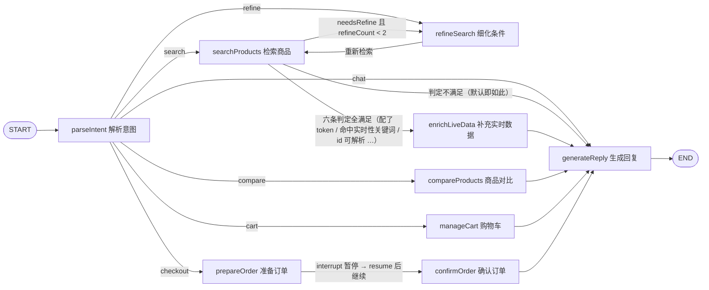
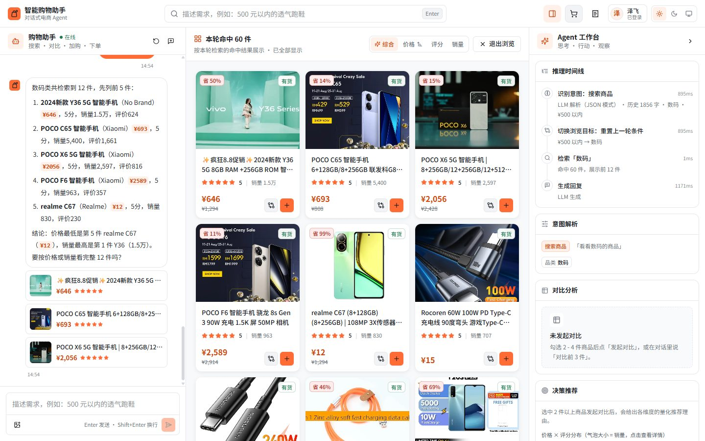
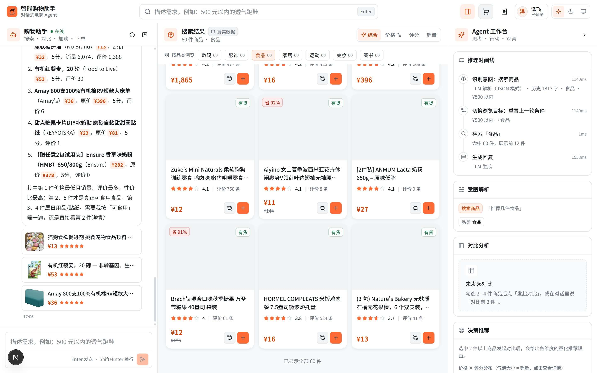
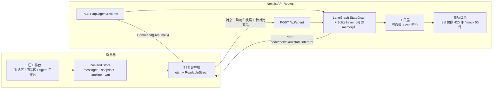
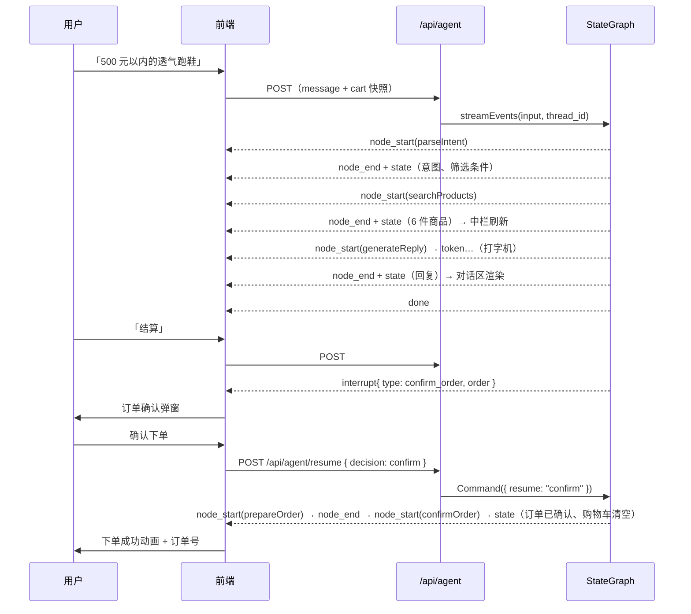

# 智能购物助手 · 对话式电商 Agent

**一句话**：用 **LangGraph 状态图**编排的对话式电商 Agent —— 说一句话就能走完「搜索 → 推荐 → 对比 → 加购 → 下单」；Agent 的思考过程、工具结果、数据来源实时画在界面上，而不是只丢一段文字。


> 上图为真实运行截图（`real` 数据源 + LLM 路径，「推荐几本小说」一轮之后的界面，2026-09-25 演示彩排）。逐步彩排记录、失败路径取证与现场翻车预案见 [docs/demo-rehearsal.md](docs/demo-rehearsal.md)。

### 三个卖点

| 卖点 | 含义 | 看哪里 |
| --- | --- | --- |
| **真实商品数据** | 420 件商品（7 品类各 60 件）来自公开的真实平台抓取样本：真实 ASIN/SKU、价格、评分、评论数、图片、参数；派生字段一律标注并降级展示。产物是**冻结快照**，界面右栏「数据快照」面板把来源、规模、覆盖率与字段分级逐项摊开 | 下文「真实商品数据」· 右栏「数据快照」面板 |
| **没有 API Key 也能完整跑通** | LLM 未配置或调用失败时自动降级为规则解析 + 模板回复，搜索 / 对比 / 加购 / 下单中断恢复全部可用，且降级是**可见**的（时间线会写明走的是哪条路） | 下文「Agent 架构」· [演示第 8 步](docs/demo-script.md) |
| **推理过程可视化** | 「思考 - 行动 - 观察」全链路落在右栏七段面板：时间线 / 意图解析 / 对比分析 / 决策推荐 / 购物车 / 你的偏好 / 数据快照（最后一段是只读的数据来源与字段分级） | [docs/architecture.md](docs/architecture.md) |

### 架构（状态图缩略）



> `refineSearch ⇄ searchProducts` 是图中唯一的环，由 `refineCount` 上限 2 强制收敛；`prepareOrder` 内 `interrupt()` 暂停、`Command({ resume })` 恢复，节点会重入（订单号因此用 seed 确定性生成）。
>
> `enrichLiveData` 是 `searchProducts → generateReply` 直线上的**条件触发补充节点**：六条判定（token 已配置 / 结果非空 / 命中实时性关键词 / 商品 id 可解析为平台 id / 距上次拉取 > 60 秒 / 当日未熔断）全部满足才进入；默认数据源（id 是 Amazon ASIN）下第 4 条自然失败 → **零调用、零行为变化**。它只覆盖 `price` 与库存等级，不新增商品、不改排序，失败完全静默（只在右栏时间线留一条中性记录）。
>
> 完整三张图（状态图 / 三层架构 / 时序图）+ **每张图的代码行对照表**：[docs/architecture.md](docs/architecture.md)

### 快速启动

```bash
npm install
npm run dev            # http://localhost:3000
# 可选：cp .env.example .env.local 并填 LLM_BASE_URL / LLM_API_KEY / LLM_MODEL；不填则走规则兜底
```

> Windows 上也可以**双击仓库根目录的 `start-agent.cmd`**：一键脚本会检查 Node 版本 → 依赖缺失时才 `npm install` → 只打印「是否已配置 LLM」（不读取密钥内容）→ 启动 dev server，并在端口就绪后自动打开浏览器；端口已被占用时只提示并打开已有服务，不重复启动。

### 演示与技术决策

- **[docs/demo-script.md](docs/demo-script.md)** —— 5 分钟 / 2 分钟演示脚本：每一步都写了「操作 / 预期画面（三栏）/ 这一步在证明什么」，三阶段（默认源 / 实时源 / 无 Key）已按脚本顺序彩排走通。
- **[docs/demo-rehearsal.md](docs/demo-rehearsal.md)** —— 演示彩排记录（2026-09-25）：逐步结果表、实测耗时、脚本逐条修正、彩排中暴露的问题与**现场翻车预案（Plan B：模型服务不可用 / 实时配额用尽 / 断网）**。
- **[docs/decisions.md](docs/decisions.md)** —— 10 条技术决策记录（背景 / 选项 / 决策 / 理由 / 代价 + 「如果被追问」）：为什么不用 tool calling、为什么不做语义记忆、为什么硬串行化、为什么库存不显示件数、为什么用 SSE 而不是 WebSocket…
- **[docs/project-status.md](docs/project-status.md)** —— 项目现状说明书：已完成 / 已验证 / 未验证 / 已知问题，**不美化**。

---

## 真实商品数据

### 数据来源

`data/real-catalog.json` 由 `scripts/build-real-catalog.mjs` 从两个公开数据集构建（都是 Bright Data 官方发布的真实抓取样本）：

| 数据集 | 用途 |
| --- | --- |
| [`luminati-io/eCommerce-dataset-samples`](https://github.com/luminati-io/eCommerce-dataset-samples) | 综合电商样本，覆盖 Amazon / Walmart / Lazada / Shopee / Shein，提供 6 个品类 |
| [`luminati-io/Amazon-popular-books-dataset`](https://github.com/luminati-io/Amazon-popular-books-dataset) | 亚马逊畅销图书样本（2269 行），专门用来补实「图书」品类 |

```bash
npm run catalog:build              # 用本地缓存（首次会自动下载）生成 data/real-catalog.json
node scripts/build-real-catalog.mjs --refresh   # 强制重新下载最新数据集
npm run catalog:localize           # 用 LLM 把文案本地化为中文 + 派生功能标签
```

| 环节 | 说明 |
| --- | --- |
| 平台 | Amazon 1000 行 → 采纳 422 条；Walmart 1000 行 → 采纳 132 条；Lazada 1000 行 → 采纳 124 条；Shopee 1000 行 → 采纳 196 条；Shein 因缺少评分字段全部丢弃；图书样本 2269 行 → 采纳 823 条 |
| 质量门槛 | 名称长度、必须有图片与描述、折算后人民币价格 10 - 20000 元、评分 ≥ 3.5（图书例外，见下）、类目可映射到本项目 7 个品类 |
| 去重 | 综合样本按「标题归一化前缀」去重；图书单独按「书名主体」去重（见下） |
| 汇率 | 多币种折算：Amazon/Walmart 是 USD，Lazada 用 MYR/IDR/THB/PHP/SGD，Shopee 还混了 MXN/CLP/COP/VND/BRL/TWD。汇率表写死在脚本里（`CURRENCY_TO_CNY`）以保证构建可复现 |
| 多语言类目 | Shopee/Lazada 的类目是西班牙语/印尼语/越南语（`Buku & Majalah` = 图书与杂志、`Deportes y Aire Libre` = 运动户外），类目规则覆盖这些语言 |
| 选品 | 每个品类按评论数取 Top `--per`（**默认 60**，7 品类 × 60 = 420 件；想缩小目录显式传 `--per=N`）。实测各品类候选数：图书 883 / 服饰 256 / 家居 213 / 运动 127 / 美妆 110 / 数码 103 / **食品 63**——食品是最紧的一档，`--per > 63` 时它取不满 |
| 缓存 | 数据集下载后缓存到 `.cache/datasets/`（已 gitignore）：反复构建不必跨境重拉几 MB，网络不稳时也能复现。要拉最新数据加 `--refresh` |

> **图书品类是怎么补实的**：综合样本里书籍极少（Amazon/Walmart 各 1000 行几乎筛不出书籍），最初只筛出 2 本真实图书。后来单独接入 `Amazon-popular-books-dataset`，图书从 2 本先补到 **16 本**，当前 `--per=60` 下是 **60 本真实书籍**（真实书名、作者、价格、评分、评论数、封面、可选版本与开本尺寸）。
>
> 这个数据集的字段结构与综合样本完全不同，因此走独立的 `normalizeBookRow`：
> - `rating` 是自然语言 `"4.6 out of 5 stars"`。**不能交给 `toNumber`**——它会把非数字字符全剥掉，得到 `"4.65"`（把 `out of 5` 里的 5 当成小数位），于是 4.6 分被读成 4.65 分，必须用正则取 `out of 5` 前面的数；
> - `categories` / `format` 是 JSON 数组字符串；
> - **`description` 不可用**：2269 行里只有 712 行非空，其中 708 行是亚马逊 A+ 详情页的原始 CSS（形如 `From the Publisher .aplus-v2 { display:block; … }`），`features` 字段只有 4 行非空。因此图书简介改为用**真实字段拼装**（作者 / 类目 / 评分与评价数 / 可选版本 / 首次上架），只陈述数据里确实存在的字段，不编造剧情梗概或营销卖点；
> - 该来源没有销量字段，`sales` 记 0（界面改展示真实评价数，见下）。
>
> **图书去重按「书名主体」而不是完整标题**：同一本书在亚马逊上有多个版本（平装 / 精装 / 纪念版 / 副标题不同），实测 16 本里出现了 4 组近重复（`The Vanishing Half: A Novel` vs `The Vanishing Half: Shortlisted for…`、`A Time for Mercy (Jake Brigance)` vs `A Time for Mercy: A Jake Brigance Novel` 等），还有一组版本后缀不带冒号（`The Wonky Donkey` vs `The Wonky Donkey Book & Toy Boxed Set`），因此用「截掉副标题 + 去掉版本噪声词 + 前缀判定」合并同书多版本。**只对图书启用**——服饰等品类的括号里装的是颜色/尺码，那是不同 SKU，合并会丢商品。
>
> **图书标签按题材派生**：通用功能词表（透气/降噪…）对图书完全失效，会让 16 本书的标签全为空。而 `matchHardFilters` 里只要 `filters.tags` 有值，标签命中不了的商品会被整条过滤掉——「推荐几本悬疑小说」会一本都搜不到。所以图书改为从真实类目路径（`Mystery, Thriller & Suspense` → 悬疑）派生题材标签，命中词同时给中英文（简介里的类目由 LLM 翻译，实测有个别条目仍保留英文）。

### 为什么没有「一键更新数据」按钮

界面上的「数据快照」面板**只读**，没有任何执行按钮（数据来源 / 构建时间 / 规模 / 覆盖率 / 字段分级 / 重建命令都在面板里摊开），这是刻意的：

1. **按钮会暗示实时性** —— 这个项目的卖点之一是「数据来源可追溯、快照冻结」，一个「更新」按钮会让人以为价格是实时拉取的，而它其实是一次几分钟的构建任务。真实的东西用文字说清楚（来源、构建时间、重建命令），而不是靠一个按钮让人觉得数据是活的。
2. **长任务不该放进请求路径** —— 构建要下载数据集（数 MB）、跑归一化与去重，本地化**首次**还要几十次 LLM 调用（实测 420 件 ≈ 70 批、约 3.7 分钟；之后有了跨产物继承，只翻新增条目）。把它塞进 Next.js 的请求里会撞上超时、无法中断、失败留半成品。
3. **无鉴权的接口会烧配额** —— 这条链路一旦暴露成 HTTP 接口，任何人都能触发：对 `justoneapi` 源意味着真实计费调用被反复触发（每件 1 次详情调用），对本地化意味着烧你自己的 LLM token。

**更新数据只有一条路径**：在终端跑

```bash
npm run catalog:build -- --per=60 && npm run catalog:localize   # real 源
```

这两步就是**完整流程，不需要任何手工补救**：`catalog:build` 写盘前会把上一版已本地化的字段继承回新构建结果（见下），`catalog:localize` 只翻没有标记的条目。跑完重启 dev。面板里给出的就是这条命令，但它**不执行**任何东西。

**产物规模与代价**：420 件 → `data/real-catalog.json` 约 451 KB（本地化中文后约 1.1 KB/件）。**这份产物不进客户端 bundle**（见下），因此 `--per` 不再影响首屏体积。

### 客户端数据流：服务端持有全量目录，客户端只有轻量数据 + 按需 chunk

```
服务端                                                 客户端
lib/catalog/products.ts（451 KB 目录 JSON，服务端模块）
  └─ app/page.tsx: buildCatalogClientPayload（纯函数，按当前源现算）
       └─ CatalogDataProvider ──► 品类计数 / CATALOG_META / 覆盖率 / 平台分布 / 12 件 featured
lib/catalog/products.ts  ── 按需 import() ──► 对话内联卡按 id 取商品（独立 chunk，首次用到才下载）
lib/catalog/products.ts  ── 按需 import() ──► 中栏浏览视图与就地展开（品类 / 全量 / 命中 id 三来源，独立 chunk，点开或「加载更多」才下载）
```

- **为什么这样切**：客户端原先静态 import 目录（`category-bar` / `product-panel` / `catalog-section` / `message-bubble` 四处），整份目录被内联进首屏 bundle——实测 First Load JS 555 kB，目录占约 **127 kB**。改完之后 **555 → 423 kB**（首屏 10 个 chunk 里搜不到任何商品 id，目录只出现在按需 chunk 里；此后 2026-09-26 新增购物车/订单抽屉与中栏三态：423 → **425 kB**，多出的 2 kB 是订单 store、抽屉组件与三态判定；同日新增浏览视图与「查看全部 N 件」入口：425 → **426 kB**（该入口当日晚些时候被中栏就地展开取代，见下）；当日晚些时候把「展示集」从中栏工作集里拆出来（**就地「加载更多」**，见下一条）：426 → **427 kB**，+1 kB 是收尾行与判据本身——浏览视图组件（**4.5 KB** chunk）与目录（410.5 KB chunk）都只在点开时下载，SSE 载荷口径未变）。
- **源感知天然成立**：载荷由服务端按 `CATALOG_SOURCE` 现算，real / mock / justoneapi 各自显示自己的件数、分布与覆盖率（real 420 件 · 各品类 60；mock 50 件 · 10/8/7/7/10/5/3；justoneapi 28 件 · 各 4），不需要第二份产物，也不可能与中栏徽标的口径不一致。
- **三处「拿目录里的商品」**：详情弹窗的商品由调用方传入（就是当前渲染的那张卡片对象，已叠加实时覆盖，所以弹窗里的「实时 · HH:mm」与卡片一致）；对话内联卡走按需 chunk，加载期间显示**与卡片同高的占位**（实测卡片 62px），chunk 到达后渲染，**失败则静默少几张卡片**（不报错、不显示「找不到」）；**中栏浏览视图**用 `React.lazy` 挂载（只有打开时才下载它的 chunk，`next/dynamic` 会把运行时带进首屏、实测 +2 kB），数据层在独立的 `lib/catalog/browse-products.ts`，加载失败**如实显示「加载失败」+ 重试**（用户主动来浏览，不该假装没有商品）。
- **已知边界**：内联卡从「首帧就有」变为「chunk 到达后出现」（首次约几十毫秒，之后命中模块缓存）。**内联卡两条路径都会挂**：模板回复与 LLM 流式回复都读服务端快照里的 `replyProductIds`——由 `selectReplyProductIds` 唯一选出（本轮检索结果前 3 件，与模板路径的历史取值一致），闲聊 / 本轮没有商品的轮次不带卡。

**跨产物继承（重建不丢已验收文案）**：`catalog:build` 在写盘前，把上一版产物里**已本地化**的五个字段（`name` / `description` / `tags` / `specifications` / `nameOriginal`）接回新构建结果，并在输出里打印继承条数：

```
继承已本地化 420 条（id + 英文原文一致），待翻译 0 条
```

判据是**双重校验**：`id` 相同 **且** 旧产物的 `nameOriginal`（英文原文）与新构建出的英文名**逐字一致**——只按 id 继承，会在数据源更新后把旧中文文案安到别的商品上。上游改了标题的条目因此会被重译一次（这是对的：标题变了，旧文案不再对应）。纯函数在 `scripts/catalog-shared.mjs`（`inheritLocalizedFields`），单测 8 条锁在 `lib/catalog/catalog-shared.test.ts`。

**本地化是增量的**：`catalog:localize` 会跳过**带 `nameOriginal` 标记**的条目（`localize-catalog.mjs` 是唯一写入者），只翻新增 / 上游标题变化的条目，失败批次下次运行自动补上。实测：420 件产物重跑 `build → localize` = **0 批 LLM 调用 / 0.4 秒**（改动前是全量 70 批 / 221.5 秒）。判据用「标记存在」而不是「中文名 ≠ 英文名」：实测有 40 件（37 图书 + 2 Lazada + 1 Amazon）的译名与英文原文**逐字相同**（书名、品牌+型号，模型按提示词保留原文），用等值判据会把这 40 件误判成未本地化、每次重建都重译。

### 哪些是真实数据，哪些是派生值

> 这份表、界面右栏的「数据快照」面板、`docs/project-status.md` §4.3 讲的是同一件事，**分级以代码里的唯一来源 `lib/catalog/field-truth.ts` 为准**（面板直接渲染它，覆盖率由当前目录实时计算）。

| 字段 | 来源 |
| --- | --- |
| 标题 / 品牌（图书为作者） / 描述 / 类目 / 商品参数 / 图片 / ASIN·SKU | **真实**，来自数据集原始字段 |
| 价格 / 原价 | **真实**（各平台原币种），按固定汇率表折算为人民币展示（USD 7.2 / MYR 1.62 / IDR 0.00045 等，见 `CURRENCY_TO_CNY`） |
| 评分 / 评论数 | **真实**；字段缺失时如实显示「暂无评分」，绝不编造分数（当前仅图书品类允许无评分） |
| 销量 | **真实，但覆盖率有限**：只有 Amazon `bought_past_month` 与 Lazada `number_sold` 是真字段。实测 Amazon 该列仅 204/1000 行有值、Shopee `sold` 全为 0、Walmart 根本没有销量列——**这些情况一律记 `sales: 0`，界面改展示真实的评价数**，不再展示销量。因此当前 420 件商品里只有 88 件带真实销量 |
| 库存状态（有货/缺货） | **真实**信号（`availability` / `is_available` / `in_stock`） |
| 库存件数 | ⚠️ **派生，且界面不展示**：真实数据源里**没有任何一件商品带真实库存件数**（只有 Shopee 有 `stock` 字段，而实测当前目录里 20 件 Shopee 商品该列全为 0 或空，因此都走了派生路径），件数全部由构建期 `21 + hash % 480` 派生。它只作为**内部可用性模型**（缺货不可加购、加购数量上限、性价比的缺货惩罚），界面一律只展示「有货 / 库存紧张 / 缺货」等级 |
| 图书简介 / 少数商品描述 | **派生文案**：这些条目的源 `description` 是亚马逊 A+ 页的原始 CSS（综合源实测 2 件——5977 / 20747 字符），不可用，改为用真实字段拼装（图书：作者 / 类目 / 评分 / 可选版本；A+ CSS 商品：品牌 / 类目 / 商品参数 / 评分，**同一套拼装规则** `buildDerivedDescription`）。产物里带 `descriptionDerived: true` 标记，件数写进 `note` |
| 中文文案 | **本地化**：商品名/描述/标签/规格值由 LLM 从英文原数据翻译（品牌与型号保留原文），价格/评分/图片/ASIN 不动 |

> 换句话说：**同一件真实商品，只是把展示语言本地化 + 换算成人民币**——这正是跨境购物站点的常规做法。原始英文名保留在 `nameOriginal` 字段，可随时回溯。
>
> **一条刻意遵守的原则：没有数据就显示没有，不用估算值填满界面。** 这条原则被应用了两次：
>
> 1. **销量**：早期版本对缺销量的来源写的是 `sales = 评价数 × 1.6`，那个估算值会被卡片当成「销量 3.4万」展示、被 LLM 当成事实引用、还被写进对比表与决策推荐（「销量最高 · 已售 6.8万 · 市场验证更充分」），而目录元信息却声称销量是真实平台数据。现在改成：来源没有该字段就记 0，界面改展示真实评价数。
> 2. **库存件数**：件数 100% 是派生的，早期版本却在详情弹窗、对比表、决策推荐里展示「库存 231 件」，对比表的「库存」行实际上在**按哈希排序**，决策推荐还把哈希值包装成「库存最充足（231 件）· 下单后发货更快」。现在改成：界面只展示等级，件数退回为内部可用性模型；「现货可发」这条推荐也只在**库存等级确实有差异**时才产出（全部有货时它不区分任何商品）。
>
> 判断语义都收敛到唯一实现：销量看 `lib/utils.ts` 的 `hasRealSales()`，库存等级看 `lib/types.ts` 的 `stockLevelOf()` / `STOCK_RANK`，避免各层各写一套导致口径分叉。

### 为什么不做实时爬取

实测过直接抓取真实平台：Amazon 直连返回 **503**（反爬拦截），淘宝/京东需要登录态 + 风控对抗，且抓取行为违反平台协议、在国内还涉及《数据安全法》《反不正当竞争法》的合规风险。因此选择「公开授权数据集 + 离线快照」这条合规路径：数据同样真实，且不依赖运行时网络（离线也能跑），需要更新时跑一次 `catalog:build` 即可。

### JustOneAPI 实时数据源（可选；不配 token 时对现有功能零影响）

**定位：`justoneapi` 是补充源与演示源，不是 `real` 快照的替代。** 它的价值是「可刷新的真实价格与库存状态」，代价是上游缺一批字段：

| 字段 | `real`（默认，HF 快照） | `justoneapi`（京东实时） |
| --- | --- | --- |
| 标题 / 品牌 / 类目 / 图片 / 价格 / 库存等级 / 商品参数 | ✅ | ✅（实时） |
| 评分 / 评论数 | ✅ 真实字段 | ❌ **京东搜索与详情端点里没有这些字段**（实测为空串 / 区间文案），一律记 0，界面按既有策略显示「暂无评分」 |
| 销量 / 划线价 / 商品描述 | 部分有（图书简介为派生） | ❌ 销量与划线价源里没有；描述为派生文案（由品牌/型号/重量等真实字段拼装） |
| 用途 | **演示与验收基线**，可复现 | 演示「可刷新的实时价格与库存」，构建期可选源 |

所以：切到 `justoneapi` 后商品卡没有评分是**上游没有该字段**，不是漏接。要补齐得接「商品评论 / 商品销量」类接口（明确放第二批）。

**启用方式**

```bash
# 1) 去 https://dashboard.justoneapi.com 取 token，写进 .env.local（只服务端读取，禁止 NEXT_PUBLIC_*）
# 2) 构建期源：
npm run catalog:build:justoneapi              # = node --env-file=.env.local scripts/build-real-catalog.mjs --source=justoneapi
npm run catalog:build:justoneapi -- --per=8   # 每个品类保留 8 件（默认 14）
# 3) 用它作运行时目录：
CATALOG_SOURCE=justoneapi npm run dev          # 未配置 token 时启动即报错，不会静默回落
```

产物写到 `data/justoneapi-catalog.json`（**不覆盖** `data/real-catalog.json`），用 `tmp + rename` 原子替换：构建失败保留上一版产物，不会留下半个文件。

**已接入端点**（只用同步 V1；V2 是异步任务，本项目不接）

| 用途 | 端点 | 实测备注 |
| --- | --- | --- |
| 搜索：价格 / 标题 / 图片 / 类目链 | `/api/jd/search-item-list/v1` | 每页 48 件。**注意早期文档写的 `search-item/v1` 实测返回 404**，正确路径带 `-list` |
| 详情：品牌 / 主图 / 库存状态 / 参数 | `/api/jd/get-item-detail/v1` | `priceFloor.price` 实测被打码为 `"1??"`（未登录态），价格取不到 |
| 价格：精确价格 | `/api/jd/get-item-price/v1` | 只返回 `{ good_id, price }`，**price 单位是分**（19800 = 198.00 元） |

**错误码速查（与官方 OpenAPI 的 15 个 code 枚举一致；业务结果一律以响应体的 `code` 为准，HTTP 状态码只作诊断）**

| code | 含义 | 是否重试 | 构建期行为 |
| --- | --- | --- | --- |
| 0 | 成功（计费） | — | 正常 |
| 100 / 101 | Token 无效或已失效 | 否 | **中止**并提示检查 `JUSTONEAPI_TOKEN` |
| 202 / 302 | 超出速率限制 | 退避后重试 1 次 | 仍失败则丢弃该条 |
| 301 | 采集失败 | 最多 3 次（指数退避 + 抖动） | 仍失败则丢弃该条 |
| 303 | 超出每日配额（HTTP 429） | 否 | **中止**，保留上一版产物 |
| 400 | 参数错误 | 否 | 丢弃该条 |
| 404 | 资源不存在（路径或商品 ID 无效） | 否 | 丢弃该条 |
| 500 | 内部服务器错误 | 最多 3 次 | 仍失败则丢弃该条 |
| 503 | 服务暂时不可用 | 最多 2 次 | 仍失败则丢弃该条 |
| 600 | 权限不足 | 否 | 中止 |
| 601 / 602 | 余额不足 / 累计消费超限 | 否 | **中止** |

**配额说明**：成功响应计费、失败不计费；每日限额按 **Asia/Shanghai 自然日**计算，同一账户下所有 token 合并计数，仅 `code=0` 计入。一次性构建的调用数 = 搜索次数（7 品类 × 2 关键词 = 14）+ 每件商品的详情调用数（≤ 品类数 × `--per`），可用 `--per` 控制。

**运行时：条件触发的补充节点 `enrichLiveData`**

图里有一个补充节点，只有在**同时满足六条判定**时才会被触发（缺一条都直接跳过到 `generateReply`，与改造前完全一致）：

| # | 判定 | 说明 |
| --- | --- | --- |
| 1 | `JUSTONEAPI_TOKEN` 已配置 | 只读 `process.env`，没配就是彻底不启用 |
| 2 | 本轮检索结果非空 | — |
| 3 | 用户输入命中实时性关键词 | 现在 / 最新 / 实时 / 当前 / 多少钱 / 涨价 / 降价 / 还有货 / 库存 / 有货 / 缺货 / 现货 |
| 4 | **至少一件商品的 id 可解析为目标平台 id** | `jd-<纯数字>`。默认 `real` 源的 id 是 Amazon ASIN，这一条自然失败 → 零调用、零行为变化 |
| 5 | 距上次拉取 > 60 秒 | 同一会话反复追问不会重复烧配额 |
| 6 | 当日未熔断 | 收到 `303 / 601 / 602`（配额用尽 / 余额不足 / 限额超限）后当日不再进入；标记锚在 `globalThis`，dev 热更新不会把它重置 |

进入节点后：**最多 3 件**商品，默认只调价格端点（`price` 单位是分，换算后覆盖展示价）；只有用户问到货/库存时才额外取详情端点读 `StockState`（每件 +1 次）。同一商品 5 分钟内走缓存（含单飞去重），失败不缓存。

- **覆盖范围只有 `price` 与库存等级**——京东搜索与详情端点里没有评分/评论数/销量（实测为空串或「1万+」区间文案），拿不到的东西不假装有；划线价会随实时价保持一致（不出现「划线价低于现价」）。
- **失败完全静默**：不抛错、不进对话文本、不弹提示，只在右栏时间线留一条中性记录（「实时数据不可用，已用快照数据」）。
- **不改筛选 / 排序 / 推荐**：实时值只作用于展示与回复上下文，不重跑检索。
- 前端三处标注（商品卡 / 详情弹窗 / 对比表价格格）都读同一份 `liveOverrides`，hover 显示拉取时刻。所有位置统一走 `lib/justoneapi/overrides.ts` 的 `applyLiveOverride`，避免出现「卡片实时价、弹窗快照价」这种分叉。

### 中文检索的 i18n 桥接

真实数据是英文的，而用户说中文，这里做了两层桥接（都在 `lib/agent/tools/productTools.ts` 与本地化脚本里）：

1. **功能标签派生**：本地化后从中文标题/描述里扫出「透气 / 轻量 / 防水 / 降噪」等功能词补成标签——源数据的 features 字段往往没有这些词，但用户一定会搜。**图书走另一套题材词表**（小说 / 悬疑 / 科幻 / 童书 / 理财…），因为功能词对图书完全失效（详见上文「图书标签按题材派生」）；
2. **同义词扩展**：`跑鞋 → 跑步鞋 / 运动鞋`、`床品 → 四件套 / 床单` 等**语义等价**的写法映射。只做等价扩展，不做「透气→轻量」这类会误导用户的放宽。

没有这两层时，「500 元以内的透气跑鞋」会先搜出 0 结果、再靠放宽条件兜回来（多绕两轮、时间线难看）；加上之后一轮命中。图书若没有题材标签更糟：`matchHardFilters` 里 `filters.tags` 命中不了会把商品整条过滤掉，问「推荐几本悬疑小说」会一本都搜不到。

---

## 技术栈

| 层次 | 选型 |
| --- | --- |
| 前端框架 | Next.js 15（App Router）+ React 19 + TypeScript（strict，无 any） |
| 样式 | Tailwind CSS v4 + shadcn/ui 组件风格（Radix UI + CVA） |
| 动画 | Framer Motion |
| 图表 | ECharts（按需引入，仅注册散点图相关模块） |
| 状态管理 | Zustand（+ persist 持久化对话与购物车） |
| 后端 | Next.js API Routes（全栈一体化） |
| Agent 框架 | `@langchain/langgraph` 1.4（StateGraph + SqliteSaver checkpoint + interrupt） |
| LLM 封装 | `@langchain/openai` 1.5（ChatOpenAI，`baseURL` 兼容 DeepSeek / 通义千问 / OpenAI） |
| 工具层 | 纯函数 + `zod` 入参校验（节点直接调用，刻意不接 tool calling，见下文「工具层」） |
| 流式 | LangGraph `streamEvents()` → 后端 SSE → 前端 `fetch` + `ReadableStream` |

---

## 快速开始

```bash
npm install

# 可选：配置 LLM（不配置则走规则兜底，功能完整可用）
cp .env.example .env.local

npm run dev        # http://localhost:3000
npm run typecheck  # 类型检查
npm test           # 单测（469 个用例：口径一致性的唯一实现、记忆机制、落地校验重试、在途请求中止、JustOneAPI 码表与映射、实时补充节点六条判定、检索命中总数与展示口径、中栏三态判定、中栏就地展开（来源选择 / 追加窗口 / 排序前载入 / 失败保留）、订单历史合并规则）
npm run build      # 生产构建
```

### 环境变量

| 变量 | 说明 | 示例 |
| --- | --- | --- |
| `LLM_BASE_URL` | OpenAI 兼容接口地址 | `https://api.deepseek.com/v1` |
| `LLM_API_KEY` | 接口密钥 | `sk-...` |
| `LLM_MODEL` | 模型名 | `deepseek-chat` / `qwen-plus` / `gpt-4o-mini` |
| `LLM_FALLBACK_ENABLED` | ⚠️ **当前实现下无实际效果**（已记为已知问题）：只要 Key 可用就会调用 LLM，Key 不可用本来就走规则兜底 —— 两种取值结果相同。要演示降级路径请让 Key **不可用**后重启：**清空**它会走「干净的规则路径」（商品区出现「规则兜底」徽标）；只写**无效值**同样会降级，但 `llmEnabled` 仍为 true、没有徽标，需指向时间线上的「规则解析 · LLM 失败」证据（2026-09-25 彩排实测，见 [demo-rehearsal.md](docs/demo-rehearsal.md) Plan B1） | `true` |
| `CATALOG_SOURCE` | 商品目录数据源：`real`（真实数据快照，默认）/ `justoneapi`（京东实时源，需 `JUSTONEAPI_TOKEN`，未配置时启动即报错）/ `mock`（内置演示数据） | `real` |
| `JUSTONEAPI_TOKEN` | 可选。京东实时数据源 token（[dashboard.justoneapi.com](https://dashboard.justoneapi.com) 获取）。**只服务端读取**，禁止写成 `NEXT_PUBLIC_*`；不配置时该源与实时补充功能整体不启用，现有功能零影响 | 空 |
| `HISTORY_ENABLED` | 是否把最近若干轮对话注入意图解析（默认 true） | `true` |
| `HISTORY_MAX_CHARS` | 历史注入的字符预算（约 2 字符 ≈ 1 token），默认 2000 | `2000` |
| `CHECKPOINT_BACKEND` | 会话持久化后端：`sqlite`（默认，落盘）/ `memory`（纯内存）。sqlite 初始化失败会自动回落 `memory` | `sqlite` |
| `CHECKPOINT_DB_PATH` | SQLite 落盘位置（包含完整对话内容，已在 `.gitignore` 中忽略，不要放进 `public/`） | `.cache/checkpoints.sqlite` |
| `SESSION_TTL_DAYS` | 超过该天数未活跃的会话会被清理（在新会话创建时惰性触发） | `7` |

> 以图搜商品会把图片作为多模态消息传给模型，需要配置支持视觉的模型（如 `gpt-4o`、`qwen-vl-max`）。

---

## 功能清单

| 能力 | 实现要点 |
| --- | --- |
| 自然语言搜索 | 意图解析 → 提取品类 / 价格区间 / 品牌 / 功能标签 / 排序，右栏以标签形式回显 |
| 多轮细化 | 「再便宜一点的」下调价格上限 30% 并重新检索；**未给出新目标时沿用上一轮条件**（「预算 500 以内」叠加在上一轮品类 / 关键词上）；本轮**新给出品类或关键词且不带细分条件**时视为切换浏览目标，自动重置上一轮的价格 / 评分 / 标签 / 品牌（时间线会写明重置了什么），排序作为展示偏好不受重置影响 |
| 会话持久化 | checkpoint 落盘到 SQLite（WAL + `busy_timeout=5000`）：**进程重启后同一 sessionId 仍能恢复上下文**。经 `CHECKPOINT_BACKEND` 可切换 `memory`；原生模块加载失败等情况下自动回落到内存态并打印原因，绝不让服务起不来 |
| 会话语义 | 「清空对话」只清消息、沿用同一个 thread；「新会话」轮换 sessionId、换一个 thread（服务端图状态也从空开始）。两者在对话区标题栏各有一个入口 |
| 会话清理 | `session_meta` 表只记录「谁多久没活跃」，删除交给官方 `saver.deleteThread()`。清理在**新会话创建时惰性触发**，并加 10 分钟最小间隔闸门（高频对话下不会反复全表扫描） |
| 指代消解（短期记忆） | 两层：① **上下文指代** —— `parseIntent` 把最近若干轮对话按字符预算裁进 prompt，因此「刚才那个再便宜点」能定位到上一轮的商品；**历史只用于消解指代，不用于推断意图类别**（prompt 里显式约束）；裁剪以「轮次」为单位，装不下就整轮丢弃，不截断单条消息；② **序数指代** —— 「换成第二件」由 `parseIntent` 解析出 `targetIndex`，再由 `searchProducts` 把结果收窄到那一件（`focusProductId` 字段，消费后即清空，避免后续 refine 轮次卡在单件）。回复侧要求 LLM **按数据顺序列举商品**，保证「第 N 件」在回复与商品区是同一个。可用 `HISTORY_ENABLED=false` 关闭历史注入 |
| 空结果处理 | 检索为空时自动放宽条件（去标签 → 去关键词 → 放大价格 → 去品类），**每轮最多 2 轮**（`refineCount` 由 `parseIntent` 每轮重置为 0，时间线写「本轮第 N/2 轮调整条件」），超限后给出可行动建议；放宽不会产出反向价格区间（`minPrice > maxPrice` 时 clamp 到单点） |
| 清空条件（看全部） | 「让我看看所有 420 件商品」这类**清空类表达**由 `detectClearAll` 判定（只看用户原话，不受 LLM 是否回写旧值影响）：命中且意图是 search / refine 时，整份条件（含品类 / 关键词）重置为「全部商品」，时间线留一条 `清空条件：重置全部筛选条件`。排除词挡住「加起来多少钱 / 平均评分」这类统计诉求，`cart / checkout / compare / chat` 轮不触发；无 Key 的规则路径同样生效 |
| 跨会话画像（跨会话记忆） | 只从真实行为（搜索 / 加购 / 成交）提取信号，存 localStorage 且与 sessionId 解耦 —— 因此「新会话」不会清掉偏好。宽泛提问时 LLM 会参考偏好、无 Key 时由模板回复带出提示，右栏「你的偏好」面板可查看来源、可一键清空。**边界：同一浏览器下有效，不等同于跨设备 / 跨用户**（详见「记忆机制」章节） |
| 分类浏览 | 中栏「按品类浏览」chip 行（7 个品类 + 各品类**目录总量**，悬停有说明）。点击 chip **直接打开中栏浏览视图**（不进对话、不带任何残留条件）：该品类**全量**网格 + 分页「加载更多」+ 排序控件 + 关闭 / ESC 退出。数据由客户端目录的**按需 chunk** 现算，**零 LLM 依赖**——没有 API Key 时同样完整可用。想带条件检索时直接在对话里说「帮我看看<品类>的商品」（走 `parseIntent → searchProducts`） |
| 浏览视图（看目录） | 中栏覆盖层，**同一组件两种数据来源**：品类全量（点 chip）/ 整个目录（「让我看看所有 420 件商品」这类无筛选条件的轮次）。分页「加载更多」+ 排序控件 + 关闭 / ESC；无筛选条件的大集合走客户端目录现算、**420 个 id 不进 SSE**；视图代码与目录都在按需 chunk 里，首屏不增加。**搜索结果的展开不在这个视图里**——那归中栏就地「加载更多」（见下一行） |
| 商品对比 | 2 - 4 件商品的参数差异表，差异项标记、各维度最优高亮，并给出量化推荐理由 |
| 购物车 | 对话指令（加购 / 删除第 N 件 / 改数量 / 清空 / 查金额）+ 面板内数量增减，金额、优惠券、运费实时计算。**两个入口**：顶栏购物车图标打开右侧抽屉（与右栏面板同一份组件），右栏「Agent 工作台」里的购物车面板保留 |
| 订单历史 | 顶栏订单图标 → 同一个抽屉的「订单历史」Tab：订单号 / 时间 / 商品 / 实付，**只记真实确认过的订单**（来源是 `confirmOrder` 的落单结果），存 localStorage，刷新不丢 |
| 下单结算 | `interrupt` 中断 → 前端弹确认弹窗 → `Command(resume)` 恢复 → 下单成功动画与订单号（抽屉里的「去结算」也走这条链路：先关抽屉再发请求，不叠层） |
| 推理可视化 | 右栏七段面板：推理时间线 / 意图解析 / 对比分析 / 决策推荐 / 购物车 / 你的偏好 / 数据快照 |
| 商品展示 | 卡片网格（容器查询自适应列数）、hover 放大、详情弹窗、快速加购、库存状态标签；中栏三态明确（**搜索结果** / **搜索无结果**：`没有找到符合条件的商品` + 放宽条件建议 + 仍给 12 件精选 / **为你推荐**），副标题写明展示口径（「共 N 件 · 展示前 M 件」，命中不多时只写件数），与「数据快照」面板里的**目录总量**区分开；**首屏 12 件 + 网格底部「加载更多」就地追加**（每次 24 件，直到该轮可得上限：有筛选条件时为本轮命中，无筛选条件时为目录全量）：追加数据由客户端目录按需解析、**不进 SSE**，到顶显示「已显示全部 N 件」，被 120 件上限截断时注明「显示前 120 件（单次上限 120 件）」；**排序作用于完整结果集**（完整集未载入时先载入再排，不会只排那 12 件）；chunk 拉不到时保留已显示的 12 件 + 一行「更多结果加载失败」+ 重试 |
| 数据可视化 | ECharts 价格 × 评分分布图（气泡大小 = 销量；整组都没有真实销量时改用评价数，图注与 tooltip 同步），点击定位商品详情 |
| 主题与响应式 | 浅色 / 深色 / 跟随系统；桌面三栏、平板折叠右栏为抽屉、移动端对话与商品二选一。窄屏（<768px）抽屉是全宽浮层，聊天输入区与对话头部**都**被提到抽屉之上（`z-50`），抽屉侧让出等高位置：否则会出现「输入框能打字、发送键被盖住、点了没反应」的静默失效，以及「清空对话 / 开启新会话」被抽屉盖住点不到 |





---

## 系统架构



### 一次完整对话的时序



---

## Agent 架构（LangGraph）

### 状态定义

`lib/agent/state.ts` 用 `Annotation.Root` 定义全局状态，所有节点共享读写。每个字段通过 `Annotation` 声明 **reducer**，决定多次写入时如何合并：

| 字段 | 合并语义 | 说明 |
| --- | --- | --- |
| `messages` | 追加（`messagesStateReducer`） | 对话历史，按 `message.id` 去重，支持 `RemoveMessage` 裁剪 |
| `intent` | 覆盖 | `search` / `refine` / `compare` / `cart` / `checkout` / `chat` |
| `searchFilters` | 浅合并 | refine 时只更新变化字段（如仅调整价格上限） |
| `searchResults` | 覆盖 | 本轮搜索结果 |
| `liveOverrides` | **合并** | 实时覆盖（键 = 商品 id）：只盖 `price`（含划线价一致性）与库存等级；**不写进 `searchResults`**，数据来源可追溯 |
| `liveFetchedAt` | 覆盖 | 上次实时拉取时刻，条件边的 60 秒冷却依据 |
| `compareTargets` | 覆盖 | 待对比商品（2 - 4 件） |
| `comparison` | 覆盖 | 对比结果（差异表 + 各维度最优 + 性价比得分） |
| `cart` | 覆盖 | 购物车 |
| `toolCallLog` | 追加 | 推理时间线，右栏可视化面板数据源 |
| `pendingOrder` | 覆盖 | 待确认订单（human-in-the-loop） |
| `needsRefine` | 覆盖 | `searchProducts → refineSearch` 条件边的判定依据 |
| `refineCount` | 覆盖 | 自动细化轮次，环的收敛保证（上限 `MAX_REFINE_ROUNDS = 2`）；**每轮由 `parseIntent` 重置为 0**（「本轮第 N/2 轮」的 N 恒 ≤ 2，放宽能力不随会话历史退化） |
| `searchResultIds` | 覆盖 | 本轮命中商品的前 `SEARCH_RESULT_ID_LIMIT = 120` 个 id（**中栏就地「加载更多」的数据源**）；仅在**有有效筛选条件且命中多于展示**时写入，快照侧按意图门挡（只有 search / refine 轮下发）。无筛选条件的大集合（如 420 件）**不下发 id**——客户端用目录现算全量 |
| `focusProductId` | 覆盖 | 序数指代的目标商品（「换成第二件」），`searchProducts` 消费后写回 `null` |
| `profilePatch` | 覆盖 | 本轮画像信号，每轮由 `parseIntent` 重置为 `[]`（同一轮内多个节点的信号累积） |
| `profileGeneration` | 覆盖 | 客户端画像 generation 的透传回显，用于丢弃「清除画像」之前发出的在途信号 |
| `profileHint` | 覆盖 | 本轮是否要在回复里带出偏好提示（判据只在 `parseIntent` 一处，`generateReply` 只负责渲染） |

### 节点清单

| 节点 | 职责 |
| --- | --- |
| `parseIntent` | LLM 结构化输出解析意图与筛选条件，失败时走规则解析器 |
| `searchProducts` | 调用 `filterProducts` 检索，命中为空时置 `needsRefine=true` |
| `refineSearch` | 合并追加条件或自动放宽条件，回到 `searchProducts` |
| `enrichLiveData` | **条件触发的补充节点**（第 9 个）：对 id 可解析的前 3 件商品用京东实时价覆盖 `price`，命中库存类关键词时额外覆盖库存等级；失败静默、只在时间线留一条中性记录 |
| `compareProducts` | 生成差异表、各维度最优与性价比得分 |
| `manageCart` | 解析购物车指令（LLM 优先 / 规则兜底）并写回 `cart` |
| `prepareOrder` | 生成订单草稿并 `interrupt()` 暂停，等待用户确认 |
| `confirmOrder` | 订单置为 confirmed、清空购物车 |
| `generateReply` | 生成最终自然语言回复（LLM 流式 / 模板兜底） |

### 条件边

```text
START → parseIntent
          ├─ search   → searchProducts
          ├─ refine   → refineSearch
          ├─ compare  → compareProducts
          ├─ cart     → manageCart
          ├─ checkout → prepareOrder
          └─ default  → generateReply

refineSearch → searchProducts                       （合并追加条件后重新检索）

searchProducts ├─ needsRefine && refineCount < 2 → refineSearch
               ├─ 实时补充六条判定全满足           → enrichLiveData
               └─ 否则                            → generateReply
enrichLiveData → generateReply                      （无条件出边）

prepareOrder   ├─ pendingOrder 非空 → confirmOrder   （interrupt 确认后恢复执行）
               └─ 否则             → generateReply
confirmOrder   → generateReply
generateReply  → END
```

**循环保护**：`refineSearch ⇄ searchProducts` 是图中唯一的环。没有计数器时，「检索为空 → 放宽条件 → 仍为空」会一直绕环，直到撞上 LangGraph 的默认递归上限抛 `GraphRecursionError`（错误信息对用户毫无意义）。因此状态里加了 `refineCount`，超过 `MAX_REFINE_ROUNDS`（2 轮）后强制走 `generateReply` 收敛。`enrichLiveData` 只是这条直线上的插入点，不进环。

### 状态图构建与编译

- `buildAgentGraph()` — 返回未编译的 `StateGraph`，可用于 LangGraph Studio 可视化
- `getAgentApp()` — 惰性编译并缓存 `CompiledStateGraph`，注入 checkpointer
- `threadConfig(sessionId)` — 传 `thread_id` 做会话隔离

`lib/agent/checkpointer.ts` 把 checkpointer 挂在 `globalThis` 上做单例：Next.js 热更新会重建模块级变量，若把 checkpointer 放在模块作用域，每次热更新都会丢掉全部会话上下文。默认后端是落盘的 `SqliteSaver`（WAL + `busy_timeout`），经 `CHECKPOINT_BACKEND` 可切 `memory`；初始化失败会自动回落并打印原因，绝不让服务起不来。换 Postgres 只需改这一个文件。

### 工具层（Tools）

`lib/agent/tools/` 提供**纯函数实现**，节点直接调用（拿到强类型结果），并按需用 zod schema 校验入参：

| 纯函数（节点直接调用） | 说明 |
| --- | --- |
| `filterProducts(filters, limit)` | 关键词优先「全命中」，无结果时降级为「任一命中」 |
| `getProductDetail(id)` | 商品详情与规格参数 |
| `compareProducts(ids)` | 差异行 + 各维度最优 + 性价比得分 |
| `addToCart / updateCartItem / removeFromCart / clearCart` | 状态变更型 |
| `summarizeCart(cart)` | 金额明细、自动选券、库存预警 |
| `buildOrderDraft(cart, options)` | 生成待确认订单草稿 |

**分层约定**：LangGraph 中状态写入只能发生在节点内，因此纯函数只做存在性 / 库存校验并返回新数组，由 `manageCart` 节点把结果写回 `AgentState.cart`。

**为什么不用 tool calling（评估后刻意不采用）**：tool calling 要解决的是「运行时动态选择未知工具集」。本项目节点是 8 个预定义节点、路由是 6 类有限分类、工具与节点几乎一一对应 —— **这个问题本身不存在**。接进来不解决任何实际问题，只是在 StateGraph 之上又叠一个隐式 agent 循环，属于架床叠屋：StateGraph 的哲学是「图本身就是编排层」，节点直调纯函数正是它的自然延伸。路由依据来自 `parseIntent` 的结构化输出（LLM 决定意图），这也是「让 LLM 参与决策」的正确落点。

> 早期版本曾把 `tool()` 契约（name/description/schema 三元组）一并写好但从未接入，属于一段死代码，现已删除；保留下来的 zod schema 用于入参校验，其中 `cartLineSchema` 还被 `/api/agent` 的请求体校验复用，消除了原先手写的重复约束。
>
> schema **不集中**到一个 `schemas.ts`，而是与自己校验的对象放在一起：`IntentSchema` 跟着产出它的 `parseIntent`，`CartActionSchema` 跟着 `manageCart`，工具入参 schema 跟着工具函数，`cartLineSchema` 跟着它约束的数据结构。四处签名的是**三种不同层**的契约（LLM 输出 / 节点入参 / HTTP 请求体），集中放一份反而会让「谁在约束谁」变模糊。

### 金额与库存规则（mock）

- 小计按**现价**合计，划线原价单独记录，`saved` 表示商品直降金额
- 自动选取满足门槛且抵扣最多的优惠券：满 300 减 30 / 满 1000 减 100 / 满 3000 减 300
- 现价合计满 99 元包邮，否则运费 12 元
- 库存：`0` 为缺货（不可加购），`≤20` 为库存紧张，加购数量超过库存时按最大可购数截断并提示。**件数不展示给用户**（它是派生值，只作为内部可用性模型），界面只显示等级；库存提醒文案也不含件数

金额规则独立在 `lib/cart-pricing.ts`（纯函数），服务端工具与前端购物车面板共用同一份实现，避免两端算出不同的价格。

### 流式事件 → 前端可视化映射

后端用 `app.streamEvents(input, { version: 'v2' })` 取事件流并转成 SSE：

| LangGraph 事件 | 前端动作 |
| --- | --- |
| `on_chain_start` | 右栏时间线新增一条「进行中」 |
| `on_chain_end` | 右栏标记完成 + 推送一次完整状态快照 |
| `on_tool_start` / `on_tool_end` | 右栏展示工具调用（当前节点直调纯函数，事件保留兼容） |
| `on_chat_model_stream` | 对话区打字机逐字输出 |
| 图结束后检测到挂起中断 | 弹出订单确认弹窗 |

SSE 事件协议（`lib/agent/events.ts`，前后端共用）：

```ts
type AgentStreamEvent =
  | { type: 'run_start'; sessionId: string }
  | { type: 'node_start'; node: string; label: string; at: number }
  | { type: 'node_end'; node: string; label: string; at: number; durationMs: number }
  | { type: 'tool_start'; tool: string; title: string }
  | { type: 'tool_end'; tool: string; title: string; detail?: string }
  | { type: 'token'; content: string }
  | { type: 'state'; payload: AgentStateSnapshot }
  | { type: 'interrupt'; order: Order }
  | { type: 'error'; message: string }
  | { type: 'done' };
```

前端 Zustand store 按事件类型分发：`token` / `state.reply` → 对话区；`node_*` / `tool_*` → 右栏推理时间线；`state` 中的 `searchResults` / `comparison` / `cart` → 中栏商品网格与右栏面板；`interrupt` → 订单确认弹窗。

---

## 记忆机制

按「作用范围」分四层：前三层已实现并逐一验证，**第四层评估后刻意不做**（理由在下面，不是「RAG 不好」，而是在这个项目里不成立）。

| 层 | 作用范围 | 实现 | 要点 |
| --- | --- | --- | --- |
| 1. 会话内短期记忆 | 当前 thread | `parseIntent` 把最近若干轮对话按字符预算裁进 prompt（`lib/agent/history.ts`） | 裁剪以「轮次」为单位，装不下就整轮丢弃、绝不截断单条消息；历史**只用于消解指代**，不用于推断意图类别 |
| 2. 会话持久化 | 同一 sessionId，跨进程重启 | checkpointer 落盘 SQLite（WAL + `busy_timeout`），`thread_id` 隔离会话；`session_meta` + 惰性 TTL 清理（`lib/agent/session-store.ts`） | 会话状态是「图自己的状态」，交给 LangGraph checkpointer 是最自然的落点；换 Postgres 只改一个文件 |
| 3. 跨会话结构化画像 | **同一浏览器**（与 sessionId 解耦） | 只从真实行为提取信号，前端幂等合并进 localStorage 的 `UserProfile`（`lib/profile.ts`） | 见下 |
| 4. 语义记忆 / 向量检索（RAG） | —— | **不做** | 见下 |

### 第 3 层：结构化画像怎么工作

- **只记真实行为**：信号只有三种来源 —— 搜索（权重 1）、加购（3）、成交（5）。提取函数只接受「搜索条件 + 命中商品」或「被加购 / 被下单的那件商品」这类对象，因此**没有行为就没有字段**（与「没有销量就显示评价数」是同一条原则：不用估算值填满界面）。
- **合并取最高权重而不是累加**：一轮里每个节点结束都会推一次状态快照（同一批信号被推多次），`interrupt` 恢复轮还会把上一轮的信号再带一遍 —— 累加会让同一批信号推几次就翻几倍。取 max 天然幂等（同一批信号应用第二次直接返回同一个对象引用）。
- **两条消费路径都真的用上它**：LLM 可用时把画像摘要注入意图解析 prompt，并在 prompt 里明确「当前输入已给出品类/关键词时一律以当前输入为准，只有输入非常宽泛（如「推荐点什么」）时才可参考偏好」；LLM 不可用时规则路径在模板回复末尾带出一句「注意到你之前常看图书，需要我按这个方向再找找吗？」。两条路径都会在右栏时间线留下一条「**记起你的偏好**」事件 —— 记忆被用到时是看得见的。
- **规则路径不改筛选条件**：画像只影响回复措辞，不参与筛选条件的生成，避免「用户从没提过数码、却被画像搜出数码」这类静默污染。
- **清除不会被在途请求复活**：清除时 `generation` 自增，携带旧 generation 的在途信号一律丢弃（主防线），同时中止在途请求（双保险）。

### 第 4 层：为什么不做语义记忆（向量检索）

1. **数据形态不支持这个必要性**：目录是 420 件**结构化**商品（品类 / 品牌 / 价格 / 评分 / 参数 / 标签齐全），偏好用「品类 + 品牌 + 关键词 + 价位」四个字段表达已经够用。把这么小的数据集灌进向量库，检索质量不会优于「关键词 + 标签过滤 + 排序」，只会多引入一层近似匹配的不确定性。
2. **引入 embedding 会破坏「没有 API Key 也能完整跑通」这条基线**：embedding 要么调外部 API（多一个 Key、多一份数据出境面），要么引入本地模型（多几百 MB 依赖与启动成本）。当前唯一的外部依赖就是**可选**的对话模型，不配也能全功能可用 —— 这个性质值得保住。
3. **架构表达会失焦**：本项目的技术叙事是「用 LangGraph 状态图做显式编排」。再叠一套向量检索 + 独立 RAG 管线，会让「图在编排什么」变含糊 —— 与其同时讲两套半成品，不如把一套讲透。

### 边界声明（如实写，不美化）

- 画像存在 **localStorage**，本质是「**同一浏览器下的跨会话记忆**」，**不是跨设备、也不是跨用户**：换电脑、换浏览器、清浏览器数据都会丢；
- 没有 userId、没有登录体系、没有云端同步 —— 换个浏览器就等于另一个「用户」；
- 每一项偏好都能追溯到一次真实操作：右栏「你的偏好」面板逐项标注来源（浏览 / 加购 / 成交），用户可一键清空；
- 服务端**不持有**画像：它只在请求生命周期内被使用（随请求体上行 → 经 `config.configurable` 注入节点 → 用完即弃），不写入 checkpoint 或任何服务端存储。

### 隐私边界

- **画像会出境**：启用画像后，画像摘要（常看品类 / 关注品牌 / 最近搜索 / 价位带）会随 prompt 发送到所配置的 LLM 服务商。当前是本地演示用途，**未做任何合规处理**（无用户告知、无数据处理协议、无出境评估）；生产环境需评估数据出境合规与用户告知义务。
- **画像不含敏感信息**：收货地址、手机号、支付方式一律不进画像 —— 提取函数只接受「搜索条件 / 被操作的商品」这类对象，结构上就拿不到这些字段；而地址、支付方式只出现在订单确认弹窗的本地状态里。
- **边界有硬上限**：最近搜索最多 10 条、单条 ≤ 12 字、品牌名 ≤ 40 字，并在 `/api/agent` 的请求边界用 zod 校验，避免被改写的 localStorage 把任意文本塞进 prompt。

---

## 三个值得展开讲的设计细节

### 1. interrupt 会让节点执行两次，订单号必须确定性生成

`interrupt()` 的实现是抛出中断信号，用户确认后 LangGraph 会**从头重新执行该节点**，只是这次 `interrupt()` 直接返回用户的决策值。所以：

- 如果节点里用 `Date.now() + 随机数` 生成订单号，两次执行会得到两个不同的单号——前端弹窗展示一个、最终落单是另一个；
- 解法是用 `thread_id + messages.length + 购物车内容` 作为 seed 做哈希（`generateOrderId(seed)`）：`messages.length` 在同一轮的两次执行中相同、跨轮会增长，因此既保证「重入后单号不变」，又保证「同一会话连下两单不会撞号」；
- 另外 `interrupt()` 之前的 `return` 会被丢弃，因此购物车金额与订单都必须在恢复之后才写入状态。

### 2. 购物车是「双端一致」的：服务端状态为准，客户端快照回传

- 服务端 `AgentState.cart` 是唯一事实来源，每次 SSE 状态推送都会覆盖前端 store；
- 前端面板上的数量增减是本地乐观更新，在下一次请求时把购物车快照作为图输入的一部分回传，因此「UI 里改过的购物车」与「图状态里的购物车」不会分叉；
- 这样既避免了为每个 UI 操作单独开接口，也保证了 `interrupt` 恢复时订单金额与用户看到的一致。

### 3. 关键词抽取只用「库里真实存在的词」

规则解析器（无 LLM 时的主路径）从商品名生成中文 2 - 4 字 n-gram 集合，用户输入的关键词必须命中这个集合才会被采用；标签与品牌词表同样从商品目录派生。这样不会出现「解析出了关键词但库里没有对应商品 → 空结果」的尴尬。关键词采用「全命中优先、无结果降级任一命中」的语义，兼顾精度与召回。

---

## 面试加分点

**为什么用 LangGraph 而不是 LangChain AgentExecutor**

- AgentExecutor 是黑盒循环，中间过程不可控、不可视化；
- StateGraph 是显式状态机，每个节点 / 边的走向可预测、可测试；
- 本项目要把推理过程可视化，StateGraph 天然产出结构化事件（`node_start` / `node_end` / `tool_*`）。

**状态图的优势**

- 条件路由声明式，加节点不影响已有逻辑（新增「优惠券推荐」只需加节点 + 连边）；
- Reducer 机制自动管理状态合并（`messages` 追加而非覆盖、`searchFilters` 浅合并）；
- 每个节点是纯函数式的 `(state) => update`，可单独测试（本项目所有节点与工具都可通过直接 `invoke` 图来验证）。

**Checkpointer 的价值**

- 多轮对话记忆：`thread_id` 隔离不同会话，同一个 thread 自动累积上下文；
- Human-in-the-loop：`interrupt` 暂停 + `Command({ resume })` 恢复，实现「下单前必须人工确认」；
- 故障恢复：执行到一半崩溃，可从最近 checkpoint 重启；
- 换持久化只需替换 checkpointer（MemorySaver → SqliteSaver / PostgresSaver），业务代码零改动。

**流式事件架构**

- `streamEvents` 统一事件协议，前后端解耦（前端只认 10 种事件类型）；
- SSE 单向推送足够，比 WebSocket 轻量，且天然适配 HTTP 基础设施；
- 用 `fetch` + `ReadableStream` 而不是 `EventSource`，因为需要 POST 携带消息体与购物车快照。

**可扩展性**

- 工具层独立：接真实电商 API 时只改 `lib/agent/tools/` 的实现，节点与前端不动；
- 新增意图只需在 `parseIntent` 的 schema 里加枚举 + 在 `routeByIntent` 加一个 case + 写一个节点；
- mock 目录与真实数据源同构（`Product` 类型统一），替换数据层不影响上层。

---

## 目录结构

```
app/
  layout.tsx                  # 全局布局：顶部导航 + 主题 / Store Provider
  page.tsx                    # 三栏工作台入口
  globals.css                 # 设计令牌（浅 / 深色）
  api/agent/route.ts          # 主入口：SSE 流式返回
  api/agent/resume/route.ts   # 中断恢复入口（Command resume）
components/
  chat/                       # 左栏：消息气泡、Markdown、输入框、思考中动画
  product/                    # 中栏：卡片网格、商品卡、详情弹窗、排序、品类入口
  visualization/              # 右栏：时间线 / 意图 / 对比 / 决策 / 购物车 / 你的偏好
  charts/                     # ECharts 封装与价格 × 评分散点图
  order/                      # 下单确认弹窗与成功动画、购物车/订单历史抽屉、订单历史列表
  layout/                     # 顶部导航、三栏骨架、主题切换
  common/                     # 面板头、分区容器、空状态
  ui/                         # shadcn/ui 风格基础组件
lib/
  types.ts                    # 领域模型（Product / CartItem / Order / ComparisonResult ...）
  utils.ts                    # cn / 价格与数量格式化（formatCount 统一口径、hasRealSales 销量语义）
  cart-pricing.ts             # 购物车金额规则（纯函数，前后端共用）
  decision.ts                 # 决策推荐理由与对比结论（纯函数）
  profile.ts                  # 跨会话画像：信号提取 + 幂等合并 + 提示文案（纯函数）
  order-history.ts            # 订单历史合并规则（纯函数：只收 confirmed、按 id 幂等、上限 20）
  agent-client.ts             # SSE 客户端（在途请求的中止入口、AbortError 分类）
  catalog/
    products.ts               # 统一商品目录入口（real / justoneapi / mock 可切换）
  justoneapi/                 # 京东实时数据源（构建期脚本与运行时共用；实现是 .mjs + .d.mts）
    codes.mjs                 # 码表与重试策略（15 个业务码）、退避公式、熔断集合
    errors.mjs                # 错误载体与可读文案
    client.mjs                # HTTP 客户端（120s 超时、先解析响应体、脱敏出口）
    cache.ts                  # 实时数据缓存（TTL 300s + 单飞 + 失败不缓存）
    types.ts                  # 实时字段类型（只覆盖易变字段）
    platforms/jd.mjs          # 京东端点、cid 类目映射、价格/库存换算
  mock/
    products/                 # 内置演示数据（50 条，按品类拆分）
    user.ts                   # 模拟用户、收货地址、优惠券
  agent/
    state.ts                  # AgentState 定义（Annotation.Root）
    graph.ts                  # StateGraph 构建 + 条件边 + 编译
    checkpointer.ts           # globalThis 单例 checkpointer（默认 SqliteSaver，可切 memory）
    history.ts                # 短期记忆：按轮次裁剪历史上下文（纯函数）
    session-store.ts          # session_meta 读写 + 惰性 TTL 清理
    llm.ts                    # ChatOpenAI 封装（未配置时优雅降级）
    structured.ts             # 结构化输出三级降级策略
    grounding.ts              # 回复落地校验（防止 LLM 编造价格）
    prompts.ts                # System Prompt 与上下文构建
    ruleParser.ts             # 规则解析器（意图 / 筛选条件 / 价格区间）
    events.ts                 # 前后端共用的流式事件协议（客户端安全）
    sse.ts                    # streamEvents → SSE 转换
    utils.ts                  # 时间线日志工厂 / 消息文本提取
    nodes/                    # 9 个节点，每个节点一个文件（含条件触发的 enrichLiveData）
    tools/                    # 商品工具 / 购物车工具
data/
  real-catalog.json           # 真实商品数据快照（默认源，由 scripts 生成）
  justoneapi-catalog.json     # 京东实时源产物（可选源，构建时刻的真实价格与库存）
scripts/
  build-real-catalog.mjs      # 多平台真实数据 → 统一 Product 模型（--source=real | justoneapi）
  catalog-shared.mjs          # 两个构建源共用的常量与纯函数（品类 / 汇率 / 价格区间 / 校验镜像）
  sources/justoneapi.mjs      # 京东实时源：搜索 → 详情 → 校验 → 原子写盘 + 丢弃统计
  localize-catalog.mjs        # LLM 文案本地化 + 功能标签派生
  justoneapi-probe.mjs        # 字段探测脚本（打印真实字段名，原始响应落 .cache/）
store/
  use-agent-store.ts          # 对话、状态快照、时间线、中断（localStorage 持久化）
  use-cart-store.ts           # 购物车（localStorage 持久化）
  use-order-store.ts          # 订单历史（localStorage 持久化；写入源是 SSE 快照里的 confirmed 订单）
  use-ui-store.ts             # 面板开合、移动端视图、待对比选择
```

---

## 对抗式审查：已修复的问题与生产化差距

### LLM 输出是不可信输入

| 风险 | 处理 |
| --- | --- |
| 结构化输出依赖单一 `response_format` | 实测 provider 不支持 JSON-Schema 形式的 `response_format`（400），`jsonMode` 又要求 prompt 含 "json" 字样。改为**三级降级**：function calling → jsonMode → 纯文本 + 手工 JSON 提取 + zod 校验，全失败才走规则兜底（`lib/agent/structured.ts`） |
| 编造价格 | `lib/agent/grounding.ts` 做**落地校验**：抽取回复里所有 ¥ 金额，逐个核对是否来自真实数据（商品价 / 原价 / 数量小计 / 优惠 / 运费 / 应付 / 两两价差），有一个对不上就判定未落地。处理是**两级**的：先带「哪些数字不在数据里」的纠正提示让模型重试一次（`invoke`，非流式 —— 否则两段候选的 token 会拼进同一个气泡），仍不符才改用模板回复，并把原因写进时间线 |
| 编造商品 id / 数量越界 | 工具 schema 用 zod 约束取值范围，节点内再用 `getProductById` / 库存上限做二次校验 |
| 静默兜底掩盖故障 | 节点不再吞异常：失败原因写入推理时间线（原先只显示「LLM 不可用」，会把「解析失败」误报成「没配 Key」） |
| 回复注入 HTML / 脚本 | react-markdown 默认转义 HTML，未启用 `rehype-raw` |

### 状态与并发

| 风险 | 处理 |
| --- | --- |
| 同一 thread 并发跑图会互相覆盖 checkpoint | `sendMessage` 里用 `thinking` 硬性串行化（不排队、不打断前一轮），UI 侧所有发送入口在运行中一并禁用；「发起对比」也加了同样的闸门 |
| 会话身份变更后旧请求还在写新列表 | 在途请求的中止**只有一个入口**（`lib/agent-client.ts` 的 `abortActiveRequest()`）：「清除画像 / 清空对话 / 开启新会话」三处统一调用它，client 内部持有 `AbortController`；store 的 catch 用 `isAbortError()`（`error.name === 'AbortError'`）区分主动中止与网络错误 —— 前者静默收尾（不弹提示、不写进消息列表），后者才提示用户 |
| Agent 执行期间改本地购物车会被服务端状态覆盖 | 执行期间禁用商品卡的加购按钮（否则用户点击会被静默丢弃） |
| localStorage 写爆 | 持久化只保留最近 40 条消息 |
| 时间线跨轮累积、越滚越长 | 服务端按本轮起点裁剪 `toolCallLog` 后再推送 |

### 跨层口径与流式输出

这一组问题的共同根因是**同一个事实在不同层被各自解释了一遍**，修正方式都是把语义收敛到唯一实现：

| 风险 | 处理 |
| --- | --- |
| 内部 LLM 调用的 JSON 泄漏到对话区 | `on_chat_model_stream` 原本对**所有**模型调用都转发 token，于是 `parseIntent` / `manageCart` 的结构化 JSON 被当聊天气泡逐字打出来。现按 `event.metadata.langgraph_node` 过滤，只转发 `generateReply`（唯一面向用户的节点）的输出 |
| **模板回复不显示（reply 恒为空）** | `node_end` 事件触发时节点刚结束，此时 `app.getState()` 读到的可能还是**提交前**的状态 —— 实测 `generateReply` 的快照里 `reply` 恒为空。而 `reply` 是「模板回复」路径唯一的来源（该路径没有 token 事件），于是**一旦 LLM 不可用，回复气泡就完全不出现**，直接打穿「无 Key 也能跑」这条卖点。现改为图收尾时**无条件**补推一次完整终态（此时图已彻底结束，状态必然完整；前端 `applySnapshot` 对同一份状态幂等） |
| 同一条回复被拆成多个气泡、跨轮文本互相串联 | 快照里的 `reply` 原本取「整个会话里最后一条 AI 消息」，而 `generateReply` 之前的节点也会各推一次快照——那时本轮还没有 AI 消息，于是**上一轮的回复**被当成新回复推给前端。现按「本轮开始前的消息条数」界定本轮，只取本轮新增的 AI 消息 |
| 气泡显示的是**被否决的**候选文本 | 落地校验否决（或重试改写）之后，服务端终态与流式候选不再是同一段文本，而前端原先只在「终态以候选为前缀」时才续写尾部 —— 其余情况静默保留候选，于是用户看到的和 Agent 实际采用的是两段话。现改为：终态不以候选为前缀时**整体替换**气泡内容并停掉打字机（`stopTypewriter` 会丢弃候选的未揭示缓冲） |
| 回复里的商品总数与商品区不一致 | 上下文只列前 5 件明细，模型把「明细条数」当成了总数（回复写「5 本」而商品区写「8 件商品」）。现显式给出总数并说明明细只是前 N 件 |
| 回复气泡被 token 分批到达切碎 | 打字机原本「缓冲一空就把气泡标记为结束」，下一批 token 到达时又新建一个（实测一条回复变成 3 - 5 个堆叠气泡）。现用显式的本轮气泡 id 作为唯一依据，直到本轮真正结束（`done` / `interrupt`）才收尾 |
| 销量口径分叉 | 见上文「哪些是真实数据」：判断语义收敛到 `hasRealSales()` 一处，卡片 / 详情 / 对比表 / 决策推荐 / 散点图 / LLM 上下文 / 落地校验全部走它 |
| 对比表把作者标成品牌且与作者行重复 | 图书数据里 `brand` 存的是作者。整组都是图书时固定行改用「作者」，并把规格里的同名行一并剔除，避免两行同值 |
| 图表 option 每帧重建、动画反复重播 | `searchResults.slice(0, 8)` 每次渲染都是新数组，会让图表 `option` 的 `useMemo` 依赖失效。现用 `useMemo` 固定引用（与既有的 `highlightIds` 字符串依赖同一类修正） |

### 尚未解决（生产化前必须处理）

1. **无鉴权、无限流**：`/api/agent` 完全开放，配了 Key 就等于把 token 额度暴露给任何访问者。生产必须加会话鉴权 + 按用户限流 + 单次请求 token 上限。
2. ~~**MemorySaver 无上限**~~：**已修** —— 默认落盘 `SqliteSaver`，并维护 `session_meta` 做惰性 TTL 清理（新会话创建时触发，10 分钟最小间隔）。跨进程重启已验证可恢复上下文。剩余边界：清理依赖进程内的闸门变量，dev 热更新会重置它（只是多扫一次表，无正确性问题）；生产应改为独立定时任务。
3. ~~**消息历史不参与 LLM 上下文**~~：**已修** —— `parseIntent` 注入最近若干轮历史（按字符预算裁剪），可消解「刚才那个」这类指代。剩余边界：长会话下超出预算的较早轮次会被整体丢弃，此时更早的指代对象不在上下文里。
4. **页面刷新 / 关闭时不中止在途请求**：这属于浏览器行为 —— 页面卸载时会话与连接一起消失，代码层只能记一条 `net::ERR_ABORTED` 却无法挽回服务端那一轮（它会跑完，无害但浪费 token）。会话身份变更（清除画像 / 清空对话 / 新会话）那条路径已经会 `abort()` 在途请求并静默收尾，不存在跨会话串写。
5. **数据快照需要手动刷新**：`data/real-catalog.json` 是构建时快照（价格/库存不会自动变化），生产环境应改为定时任务调用 `npm run catalog:build`，或直接替换 `lib/catalog/products.ts` 为实时电商 API 客户端（上层工具、节点、组件无需改动）。
6. ~~**`tool()` 契约尚未接入 LLM**~~：**已决策（方案 b）** —— 评估后判定 tool calling 在本项目中是多余的间接层（节点预设、路由有限、工具与节点一一对应，「动态选择工具集」这个问题不存在），已删除 `tool()` 包装与未被引用的两个数组，保留 zod schema 用于入参校验。详见上文「工具层」。
7. ~~**分类浏览入口未实现**~~：**已实现（2026-09-26 起改为直接打开浏览视图）** —— 中栏顶部「按品类浏览」chip 行（品类 + 件数）点击即打开该品类的**全量浏览视图**（客户端目录按需 chunk 现算，零 LLM 依赖、不进对话、不带残留条件）；带条件的品类检索仍可用对话「帮我看看<品类>的商品」。同一视图还承载「看全部 420 件」（客户端目录全量，无筛选条件的轮次）；**搜索结果的展开归中栏就地「加载更多」**（2026-09-26 收口，原先的「查看全部 N 件」入口已删）。
8. **控制台偶发 `net::ERR_ABORTED`**：在途 SSE 请求被**页面刷新 / 导航**打断时浏览器会记一条 `net::ERR_ABORTED` —— 属浏览器行为，不影响功能，代码层不做处理（卸载时机上没有可挽救的动作）。主动中止的三个场景（清除画像 / 清空对话 / 开启新会话）不会产生这条噪声：中止统一走 `lib/agent-client.ts` 的 `abortActiveRequest()`，catch 里用 `error.name === 'AbortError'` 与网络错误区分，前者静默收尾。此外，销量覆盖率有限（112 件里 17 件有真实销量），若希望卡片普遍显示销量，应接入带销量字段的数据源。

---

## 设计令牌

| 令牌 | 浅色 | 深色 | 用途 |
| --- | --- | --- | --- |
| 品牌主色 | `#FF6B35` | 同左 | 按钮、高亮、选中状态 |
| 橙色文字 | `#D2440A` | `#FF8A5C` | 价格、链接（保证对比度） |
| 背景 | `#F8F9FA` | `#1E2125` | 页面背景 |
| 卡片 | `#FFFFFF` | `#262A2F` | 卡片 / 面板 |
| 侧边栏 | `#FFFFFF` | `#17191C` | 对话区、右栏底色 |
| 圆角 | 小控件 6px / 按钮 8px / 卡片 12px / 气泡 16px | 同左 | — |
| 阴影 | `0 2px 8px rgba(0,0,0,.08)` | `0 2px 8px rgba(0,0,0,.4)` | 仅 2 级，表达真实层级 |

**无障碍**：品牌橙 `#FF6B35` 上的文字使用深墨色（对比度 5.96:1）；橙色文字使用 `#D2440A`（4.59:1）与深色模式下的 `#FF8A5C`；正文与次要文字均满足 WCAG-AA。所有图标使用 Lucide 矢量图标，无 emoji。
