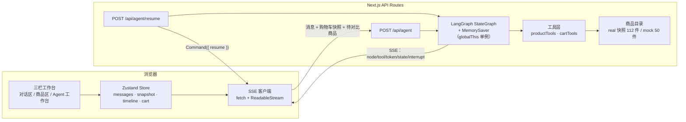
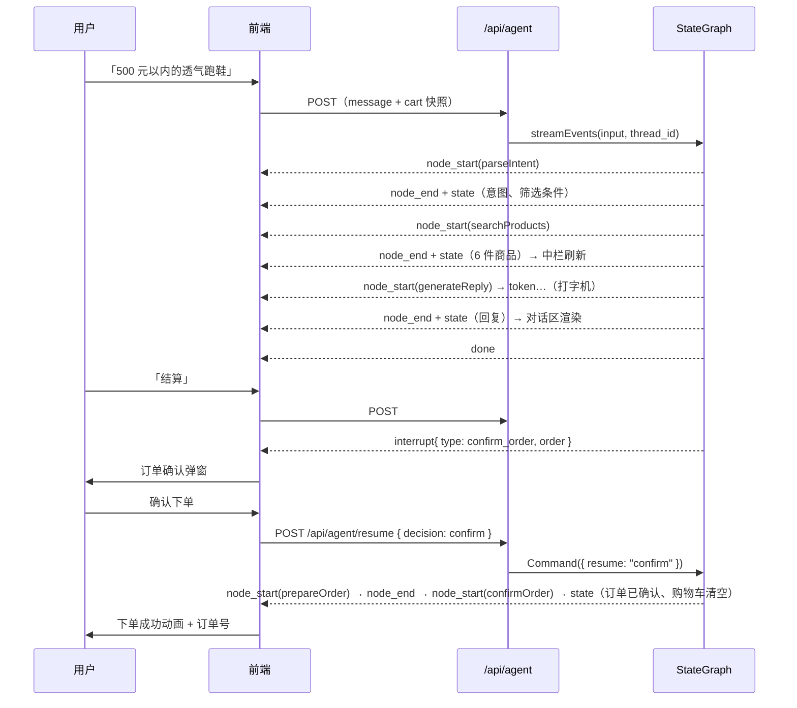

# 智能购物助手 · 对话式电商 Agent

以对话为核心交互方式的电商 Agent Web 应用。用户用自然语言即可完成**商品搜索 → 智能推荐 → 多维度对比 → 购物车管理 → 下单结算**的全流程；Agent 的「思考 - 行动 - 观察」全链路以可视化组件实时呈现，而不是纯文本输出。

Agent 侧基于 **LangGraph.js 状态图（StateGraph）** 构建，采用「状态图编排 + 工具调用 + 事件流可视化」三层设计。

商品目录使用**真实电商平台数据**（112 件商品，7 个品类各 16 件；含真实 ASIN/SKU、价格、评分、评论数、图片与商品参数），数据来自两个公开抓取样本仓库（综合电商样本 + 亚马逊畅销图书样本），由 `scripts/build-real-catalog.mjs` 生成快照，可随时刷新；也保留了一套内置精编数据用于离线对比（`CATALOG_SOURCE=mock`）。

**没有 API Key 也能完整跑通全流程**：LLM 未配置或调用失败时，自动降级为规则解析 + 模板回复，所有功能（搜索、对比、加购、下单中断恢复）都可正常使用。

---

## 真实商品数据

### 数据来源

`data/real-catalog.json` 由 `scripts/build-real-catalog.mjs` 从两个公开数据集构建（都是 Bright Data 官方发布的真实抓取样本）：

| 数据集 | 用途 |
| --- | --- |
| [`luminati-io/eCommerce-dataset-samples`](https://github.com/luminati-io/eCommerce-dataset-samples) | 综合电商样本，覆盖 Amazon / Walmart / Lazada / Shopee / Shein，提供 6 个品类 |
| [`luminati-io/Amazon-popular-books-dataset`](https://github.com/luminati-io/Amazon-popular-books-dataset) | 亚马逊畅销图书样本（2269 行），专门用来补实「图书」品类 |

```bash
npm run catalog:build              # 用本地缓存（首次会自动下载）生成 data/real-catalog.json
node scripts/build-real-catalog.mjs --refresh   # 强制重新下载最新数据集
npm run catalog:localize           # 用 LLM 把文案本地化为中文 + 派生功能标签
```

| 环节 | 说明 |
| --- | --- |
| 平台 | Amazon 1000 行 → 采纳 422 条；Walmart 1000 行 → 采纳 132 条；Lazada 1000 行 → 采纳 124 条；Shopee 1000 行 → 采纳 196 条；Shein 因缺少评分字段全部丢弃；图书样本 2269 行 → 采纳 823 条 |
| 质量门槛 | 名称长度、必须有图片与描述、折算后人民币价格 10 - 20000 元、评分 ≥ 3.5（图书例外，见下）、类目可映射到本项目 7 个品类 |
| 去重 | 综合样本按「标题归一化前缀」去重；图书单独按「书名主体」去重（见下） |
| 汇率 | 多币种折算：Amazon/Walmart 是 USD，Lazada 用 MYR/IDR/THB/PHP/SGD，Shopee 还混了 MXN/CLP/COP/VND/BRL/TWD。汇率表写死在脚本里（`CURRENCY_TO_CNY`）以保证构建可复现 |
| 多语言类目 | Shopee/Lazada 的类目是西班牙语/印尼语/越南语（`Buku & Majalah` = 图书与杂志、`Deportes y Aire Libre` = 运动户外），类目规则覆盖这些语言 |
| 选品 | 每个品类按评论数取 Top 16（评论多的更可信、更有真实感） |
| 缓存 | 数据集下载后缓存到 `.cache/datasets/`（已 gitignore）：反复构建不必跨境重拉几 MB，网络不稳时也能复现。要拉最新数据加 `--refresh` |

> **图书品类是怎么补实的**：综合样本里书籍极少（Amazon/Walmart 各 1000 行几乎筛不出书籍），最初只筛出 2 本真实图书。后来单独接入 `Amazon-popular-books-dataset`，图书从 2 本补到 **16 本真实书籍**（真实书名、作者、价格、评分、评论数、封面、可选版本与开本尺寸）。
>
> 这个数据集的字段结构与综合样本完全不同，因此走独立的 `normalizeBookRow`：
> - `rating` 是自然语言 `"4.6 out of 5 stars"`。**不能交给 `toNumber`**——它会把非数字字符全剥掉，得到 `"4.65"`（把 `out of 5` 里的 5 当成小数位），于是 4.6 分被读成 4.65 分，必须用正则取 `out of 5` 前面的数；
> - `categories` / `format` 是 JSON 数组字符串；
> - **`description` 不可用**：2269 行里只有 712 行非空，其中 708 行是亚马逊 A+ 详情页的原始 CSS（形如 `From the Publisher .aplus-v2 { display:block; … }`），`features` 字段只有 4 行非空。因此图书简介改为用**真实字段拼装**（作者 / 类目 / 评分与评价数 / 可选版本 / 首次上架），只陈述数据里确实存在的字段，不编造剧情梗概或营销卖点；
> - 该来源没有销量字段，`sales` 记 0（界面改展示真实评价数，见下）。
>
> **图书去重按「书名主体」而不是完整标题**：同一本书在亚马逊上有多个版本（平装 / 精装 / 纪念版 / 副标题不同），实测 16 本里出现了 4 组近重复（`The Vanishing Half: A Novel` vs `The Vanishing Half: Shortlisted for…`、`A Time for Mercy (Jake Brigance)` vs `A Time for Mercy: A Jake Brigance Novel` 等），还有一组版本后缀不带冒号（`The Wonky Donkey` vs `The Wonky Donkey Book & Toy Boxed Set`），因此用「截掉副标题 + 去掉版本噪声词 + 前缀判定」合并同书多版本。**只对图书启用**——服饰等品类的括号里装的是颜色/尺码，那是不同 SKU，合并会丢商品。
>
> **图书标签按题材派生**：通用功能词表（透气/降噪…）对图书完全失效，会让 16 本书的标签全为空。而 `matchHardFilters` 里只要 `filters.tags` 有值，标签命中不了的商品会被整条过滤掉——「推荐几本悬疑小说」会一本都搜不到。所以图书改为从真实类目路径（`Mystery, Thriller & Suspense` → 悬疑）派生题材标签，命中词同时给中英文（简介里的类目由 LLM 翻译，实测有个别条目仍保留英文）。

### 哪些是真实数据，哪些是派生值

| 字段 | 来源 |
| --- | --- |
| 标题 / 品牌（图书为作者） / 描述 / 类目 / 商品参数 / 图片 / ASIN·SKU | **真实**，来自数据集原始字段 |
| 价格 / 原价 | **真实**（各平台原币种），按固定汇率表折算为人民币展示（USD 7.2 / MYR 1.62 / IDR 0.00045 等，见 `CURRENCY_TO_CNY`） |
| 评分 / 评论数 | **真实**；字段缺失时如实显示「暂无评分」，绝不编造分数（当前仅图书品类允许无评分） |
| 销量 | **真实，但覆盖率有限**：只有 Amazon `bought_past_month` 与 Lazada `number_sold` 是真字段。实测 Amazon 该列仅 204/1000 行有值、Shopee `sold` 全为 0、Walmart 根本没有销量列——**这些情况一律记 `sales: 0`，界面改展示真实的评价数**，不再展示销量。因此当前 112 件商品里只有 17 件带真实销量 |
| 库存状态（有货/缺货） | **真实**信号（`availability` / `is_available` / `in_stock`） |
| 库存件数 | ⚠️ **派生，且界面不展示**：真实数据源里**没有任何一件商品带真实库存件数**（只有 Shopee 有 `stock` 字段，而当前目录已无 Shopee 商品），件数全部由构建期 `21 + hash % 480` 派生。它只作为**内部可用性模型**（缺货不可加购、加购数量上限、性价比的缺货惩罚），界面一律只展示「有货 / 库存紧张 / 缺货」等级 |
| 图书简介 | **派生文案**：源数据的 `description` 是 A+ 页面原始 CSS，不可用，改为用真实字段拼装（见上） |
| 中文文案 | **本地化**：商品名/描述/标签/规格值由 LLM 从英文原数据翻译（品牌与型号保留原文），价格/评分/图片/ASIN 不动 |

> 换句话说：**同一件真实商品，只是把展示语言本地化 + 换算成人民币**——这正是跨境购物站点的常规做法。原始英文名保留在 `nameOriginal` 字段，可随时回溯。
>
> **一条刻意遵守的原则：没有数据就显示没有，不用估算值填满界面。** 这条原则被应用了两次：
>
> 1. **销量**：早期版本对缺销量的来源写的是 `sales = 评价数 × 1.6`，那个估算值会被卡片当成「销量 3.4万」展示、被 LLM 当成事实引用、还被写进对比表与决策推荐（「销量最高 · 已售 6.8万 · 市场验证更充分」），而目录元信息却声称销量是真实平台数据。现在改成：来源没有该字段就记 0，界面改展示真实评价数。
> 2. **库存件数**：件数 100% 是派生的，早期版本却在详情弹窗、对比表、决策推荐里展示「库存 231 件」，对比表的「库存」行实际上在**按哈希排序**，决策推荐还把哈希值包装成「库存最充足（231 件）· 下单后发货更快」。现在改成：界面只展示等级，件数退回为内部可用性模型；「现货可发」这条推荐也只在**库存等级确实有差异**时才产出（全部有货时它不区分任何商品）。
>
> 判断语义都收敛到唯一实现：销量看 `lib/utils.ts` 的 `hasRealSales()`，库存等级看 `lib/types.ts` 的 `stockLevelOf()` / `STOCK_RANK`，避免各层各写一套导致口径分叉。

### 为什么不做实时爬取

实测过直接抓取真实平台：Amazon 直连返回 **503**（反爬拦截），淘宝/京东需要登录态 + 风控对抗，且抓取行为违反平台协议、在国内还涉及《数据安全法》《反不正当竞争法》的合规风险。因此选择「公开授权数据集 + 离线快照」这条合规路径：数据同样真实，且不依赖运行时网络（离线也能跑），需要更新时跑一次 `catalog:build` 即可。

### 中文检索的 i18n 桥接

真实数据是英文的，而用户说中文，这里做了两层桥接（都在 `lib/agent/tools/productTools.ts` 与本地化脚本里）：

1. **功能标签派生**：本地化后从中文标题/描述里扫出「透气 / 轻量 / 防水 / 降噪」等功能词补成标签——源数据的 features 字段往往没有这些词，但用户一定会搜。**图书走另一套题材词表**（小说 / 悬疑 / 科幻 / 童书 / 理财…），因为功能词对图书完全失效（详见上文「图书标签按题材派生」）；
2. **同义词扩展**：`跑鞋 → 跑步鞋 / 运动鞋`、`床品 → 四件套 / 床单` 等**语义等价**的写法映射。只做等价扩展，不做「透气→轻量」这类会误导用户的放宽。

没有这两层时，「500 元以内的透气跑鞋」会先搜出 0 结果、再靠放宽条件兜回来（多绕两轮、时间线难看）；加上之后一轮命中。图书若没有题材标签更糟：`matchHardFilters` 里 `filters.tags` 命中不了会把商品整条过滤掉，问「推荐几本悬疑小说」会一本都搜不到。

---

## 技术栈

| 层次 | 选型 |
| --- | --- |
| 前端框架 | Next.js 15（App Router）+ React 19 + TypeScript（strict，无 any） |
| 样式 | Tailwind CSS v4 + shadcn/ui 组件风格（Radix UI + CVA） |
| 动画 | Framer Motion |
| 图表 | ECharts（按需引入，仅注册散点图相关模块） |
| 状态管理 | Zustand（+ persist 持久化对话与购物车） |
| 后端 | Next.js API Routes（全栈一体化） |
| Agent 框架 | `@langchain/langgraph` 1.4（StateGraph + MemorySaver + interrupt） |
| LLM 封装 | `@langchain/openai` 1.5（ChatOpenAI，`baseURL` 兼容 DeepSeek / 通义千问 / OpenAI） |
| 工具定义 | `@langchain/core/tools` 的 `tool()` + `zod` schema |
| 流式 | LangGraph `streamEvents()` → 后端 SSE → 前端 `fetch` + `ReadableStream` |

---

## 快速开始

```bash
npm install

# 可选：配置 LLM（不配置则走规则兜底，功能完整可用）
cp .env.example .env.local

npm run dev        # http://localhost:3000
npm run typecheck  # 类型检查
npm test           # 纯函数单测（84 个用例，覆盖口径一致性的唯一实现）
npm run build      # 生产构建
```

### 环境变量

| 变量 | 说明 | 示例 |
| --- | --- | --- |
| `LLM_BASE_URL` | OpenAI 兼容接口地址 | `https://api.deepseek.com/v1` |
| `LLM_API_KEY` | 接口密钥 | `sk-...` |
| `LLM_MODEL` | 模型名 | `deepseek-chat` / `qwen-plus` / `gpt-4o-mini` |
| `LLM_FALLBACK_ENABLED` | 是否允许规则兜底（默认 true） | `true` |
| `CATALOG_SOURCE` | 商品目录数据源：`real`（真实数据快照，默认）/ `mock`（内置演示数据） | `real` |
| `HISTORY_ENABLED` | 是否把最近若干轮对话注入意图解析（默认 true） | `true` |
| `HISTORY_MAX_CHARS` | 历史注入的字符预算（约 2 字符 ≈ 1 token），默认 2000 | `2000` |

> 以图搜商品会把图片作为多模态消息传给模型，需要配置支持视觉的模型（如 `gpt-4o`、`qwen-vl-max`）。

---

## 功能清单

| 能力 | 实现要点 |
| --- | --- |
| 自然语言搜索 | 意图解析 → 提取品类 / 价格区间 / 品牌 / 功能标签 / 排序，右栏以标签形式回显 |
| 多轮细化 | 「再便宜一点的」下调价格上限 30% 并重新检索；新条件稀疏时自动沿用上一轮条件 |
| 指代消解（短期记忆） | 两层：① **上下文指代** —— `parseIntent` 把最近若干轮对话按字符预算裁进 prompt，因此「刚才那个再便宜点」能定位到上一轮的商品；**历史只用于消解指代，不用于推断意图类别**（prompt 里显式约束）；裁剪以「轮次」为单位，装不下就整轮丢弃，不截断单条消息；② **序数指代** —— 「换成第二件」由 `parseIntent` 解析出 `targetIndex`，再由 `searchProducts` 把结果收窄到那一件（`focusProductId` 字段，消费后即清空，避免后续 refine 轮次卡在单件）。回复侧要求 LLM **按数据顺序列举商品**，保证「第 N 件」在回复与商品区是同一个。可用 `HISTORY_ENABLED=false` 关闭历史注入 |
| 空结果处理 | 检索为空时自动放宽条件（去标签 → 去关键词 → 放大价格 → 去品类），最多 2 轮，超限后给出可行动建议 |
| 商品对比 | 2 - 4 件商品的参数差异表，差异项标记、各维度最优高亮，并给出量化推荐理由 |
| 购物车 | 对话指令（加购 / 删除第 N 件 / 改数量 / 清空 / 查金额）+ 面板内数量增减，金额、优惠券、运费实时计算 |
| 下单结算 | `interrupt` 中断 → 前端弹确认弹窗 → `Command(resume)` 恢复 → 下单成功动画与订单号 |
| 推理可视化 | 右栏五段面板：推理时间线 / 意图解析 / 对比分析 / 决策推荐 / 购物车 |
| 商品展示 | 卡片网格（容器查询自适应列数）、hover 放大、详情弹窗、快速加购、库存状态标签 |
| 数据可视化 | ECharts 价格 × 评分分布图（气泡大小 = 销量；整组都没有真实销量时改用评价数，图注与 tooltip 同步），点击定位商品详情 |
| 主题与响应式 | 浅色 / 深色 / 跟随系统；桌面三栏、平板折叠右栏为抽屉、移动端对话与商品二选一。窄屏（<768px）抽屉是全宽浮层，聊天输入区被提到抽屉之上（`z-50`），保证「发送」始终可见可点 —— 否则会出现「输入框能打字、发送键被盖住、点了没反应」的静默失效 |

---

## 系统架构



### 一次完整对话的时序



---

## Agent 架构（LangGraph）

### 状态定义

`lib/agent/state.ts` 用 `Annotation.Root` 定义全局状态，所有节点共享读写。每个字段通过 `Annotation` 声明 **reducer**，决定多次写入时如何合并：

| 字段 | 合并语义 | 说明 |
| --- | --- | --- |
| `messages` | 追加（`messagesStateReducer`） | 对话历史，按 `message.id` 去重，支持 `RemoveMessage` 裁剪 |
| `intent` | 覆盖 | `search` / `refine` / `compare` / `cart` / `checkout` / `chat` |
| `searchFilters` | 浅合并 | refine 时只更新变化字段（如仅调整价格上限） |
| `searchResults` | 覆盖 | 本轮搜索结果 |
| `compareTargets` | 覆盖 | 待对比商品（2 - 4 件） |
| `comparison` | 覆盖 | 对比结果（差异表 + 各维度最优 + 性价比得分） |
| `cart` | 覆盖 | 购物车 |
| `toolCallLog` | 追加 | 推理时间线，右栏可视化面板数据源 |
| `pendingOrder` | 覆盖 | 待确认订单（human-in-the-loop） |
| `needsRefine` | 覆盖 | `searchProducts → refineSearch` 条件边的判定依据 |
| `refineCount` | 覆盖 | 自动细化轮次，环的收敛保证（上限 `MAX_REFINE_ROUNDS = 2`） |

### 节点清单

| 节点 | 职责 |
| --- | --- |
| `parseIntent` | LLM 结构化输出解析意图与筛选条件，失败时走规则解析器 |
| `searchProducts` | 调用 `filterProducts` 检索，命中为空时置 `needsRefine=true` |
| `refineSearch` | 合并追加条件或自动放宽条件，回到 `searchProducts` |
| `compareProducts` | 生成差异表、各维度最优与性价比得分 |
| `manageCart` | 解析购物车指令（LLM 优先 / 规则兜底）并写回 `cart` |
| `prepareOrder` | 生成订单草稿并 `interrupt()` 暂停，等待用户确认 |
| `confirmOrder` | 订单置为 confirmed、清空购物车 |
| `generateReply` | 生成最终自然语言回复（LLM 流式 / 模板兜底） |

### 条件边

```text
START → parseIntent
          ├─ search   → searchProducts
          ├─ refine   → refineSearch
          ├─ compare  → compareProducts
          ├─ cart     → manageCart
          ├─ checkout → prepareOrder
          └─ default  → generateReply

refineSearch → searchProducts                       （合并追加条件后重新检索）

searchProducts ├─ needsRefine && refineCount < 2 → refineSearch
               └─ 否则                            → generateReply

prepareOrder   ├─ pendingOrder 非空 → confirmOrder   （interrupt 确认后恢复执行）
               └─ 否则             → generateReply
confirmOrder   → generateReply
generateReply  → END
```

**循环保护**：`refineSearch ⇄ searchProducts` 是图中唯一的环。没有计数器时，「检索为空 → 放宽条件 → 仍为空」会一直绕环，直到撞上 LangGraph 的默认递归上限抛 `GraphRecursionError`（错误信息对用户毫无意义）。因此状态里加了 `refineCount`，超过 `MAX_REFINE_ROUNDS`（2 轮）后强制走 `generateReply` 收敛。

### 状态图构建与编译

- `buildAgentGraph()` — 返回未编译的 `StateGraph`，可用于 LangGraph Studio 可视化
- `getAgentApp()` — 惰性编译并缓存 `CompiledStateGraph`，注入 checkpointer
- `threadConfig(sessionId)` — 传 `thread_id` 做会话隔离

`lib/agent/checkpointer.ts` 把 `MemorySaver` 挂在 `globalThis` 上做单例：Next.js 热更新会重建模块级变量，若把 checkpointer 放在模块作用域，每次热更新都会丢掉全部会话上下文。生产切换 Sqlite / Postgres 只需改这一个文件。

### 工具层（Tools）

`lib/agent/tools/` 下每个能力都提供**两份实现**，共享同一份底层纯函数，不会出现行为分叉：

| 纯函数（节点直接调用） | LLM 工具契约（`tool()`） | 说明 |
| --- | --- | --- |
| `filterProducts(filters, limit)` | `search_products` | 关键词优先「全命中」，无结果时降级为「任一命中」 |
| `getProductDetail(id)` | `get_product_detail` | 商品详情与规格参数 |
| `compareProducts(ids)` | `compare_products` | 差异行 + 各维度最优 + 性价比得分 |
| `addToCart / updateCartItem / removeFromCart / clearCart` | `add_to_cart` / `update_cart_item` / `remove_from_cart` / `clear_cart` | 状态变更型 |
| `summarizeCart(cart)` | `get_cart_summary` | 金额明细、自动选券、库存预警 |
| `buildOrderDraft(cart, options)` | `create_order` | 生成待确认订单草稿 |

**分层约定**：LangGraph 中状态写入只能发生在节点内，因此「状态变更型」工具只负责把自然语言解析成结构化指令并做存在性 / 库存校验，真正的数组变更由 `manageCart` 节点调用同名纯函数完成，再把新数组写回 `AgentState.cart`。「计算型」工具（`get_cart_summary` / `create_order`）无副作用，节点可直接调用。

### 金额与库存规则（mock）

- 小计按**现价**合计，划线原价单独记录，`saved` 表示商品直降金额
- 自动选取满足门槛且抵扣最多的优惠券：满 300 减 30 / 满 1000 减 100 / 满 3000 减 300
- 现价合计满 99 元包邮，否则运费 12 元
- 库存：`0` 为缺货（不可加购），`≤20` 为库存紧张，加购数量超过库存时按最大可购数截断并提示。**件数不展示给用户**（它是派生值，只作为内部可用性模型），界面只显示等级；库存提醒文案也不含件数

金额规则独立在 `lib/cart-pricing.ts`（纯函数），服务端工具与前端购物车面板共用同一份实现，避免两端算出不同的价格。

### 流式事件 → 前端可视化映射

后端用 `app.streamEvents(input, { version: 'v2' })` 取事件流并转成 SSE：

| LangGraph 事件 | 前端动作 |
| --- | --- |
| `on_chain_start` | 右栏时间线新增一条「进行中」 |
| `on_chain_end` | 右栏标记完成 + 推送一次完整状态快照 |
| `on_tool_start` / `on_tool_end` | 右栏展示工具调用（当前节点直调纯函数，事件保留兼容） |
| `on_chat_model_stream` | 对话区打字机逐字输出 |
| 图结束后检测到挂起中断 | 弹出订单确认弹窗 |

SSE 事件协议（`lib/agent/events.ts`，前后端共用）：

```ts
type AgentStreamEvent =
  | { type: 'run_start'; sessionId: string }
  | { type: 'node_start'; node: string; label: string; at: number }
  | { type: 'node_end'; node: string; label: string; at: number; durationMs: number }
  | { type: 'tool_start'; tool: string; title: string }
  | { type: 'tool_end'; tool: string; title: string; detail?: string }
  | { type: 'token'; content: string }
  | { type: 'state'; payload: AgentStateSnapshot }
  | { type: 'interrupt'; order: Order }
  | { type: 'error'; message: string }
  | { type: 'done' };
```

前端 Zustand store 按事件类型分发：`token` / `state.reply` → 对话区；`node_*` / `tool_*` → 右栏推理时间线；`state` 中的 `searchResults` / `comparison` / `cart` → 中栏商品网格与右栏面板；`interrupt` → 订单确认弹窗。

---

## 三个值得展开讲的设计细节

### 1. interrupt 会让节点执行两次，订单号必须确定性生成

`interrupt()` 的实现是抛出中断信号，用户确认后 LangGraph 会**从头重新执行该节点**，只是这次 `interrupt()` 直接返回用户的决策值。所以：

- 如果节点里用 `Date.now() + 随机数` 生成订单号，两次执行会得到两个不同的单号——前端弹窗展示一个、最终落单是另一个；
- 解法是用 `thread_id + messages.length + 购物车内容` 作为 seed 做哈希（`generateOrderId(seed)`）：`messages.length` 在同一轮的两次执行中相同、跨轮会增长，因此既保证「重入后单号不变」，又保证「同一会话连下两单不会撞号」；
- 另外 `interrupt()` 之前的 `return` 会被丢弃，因此购物车金额与订单都必须在恢复之后才写入状态。

### 2. 购物车是「双端一致」的：服务端状态为准，客户端快照回传

- 服务端 `AgentState.cart` 是唯一事实来源，每次 SSE 状态推送都会覆盖前端 store；
- 前端面板上的数量增减是本地乐观更新，在下一次请求时把购物车快照作为图输入的一部分回传，因此「UI 里改过的购物车」与「图状态里的购物车」不会分叉；
- 这样既避免了为每个 UI 操作单独开接口，也保证了 `interrupt` 恢复时订单金额与用户看到的一致。

### 3. 关键词抽取只用「库里真实存在的词」

规则解析器（无 LLM 时的主路径）从商品名生成中文 2 - 4 字 n-gram 集合，用户输入的关键词必须命中这个集合才会被采用；标签与品牌词表同样从商品目录派生。这样不会出现「解析出了关键词但库里没有对应商品 → 空结果」的尴尬。关键词采用「全命中优先、无结果降级任一命中」的语义，兼顾精度与召回。

---

## 面试加分点

**为什么用 LangGraph 而不是 LangChain AgentExecutor**

- AgentExecutor 是黑盒循环，中间过程不可控、不可视化；
- StateGraph 是显式状态机，每个节点 / 边的走向可预测、可测试；
- 本项目要把推理过程可视化，StateGraph 天然产出结构化事件（`node_start` / `node_end` / `tool_*`）。

**状态图的优势**

- 条件路由声明式，加节点不影响已有逻辑（新增「优惠券推荐」只需加节点 + 连边）；
- Reducer 机制自动管理状态合并（`messages` 追加而非覆盖、`searchFilters` 浅合并）；
- 每个节点是纯函数式的 `(state) => update`，可单独测试（本项目所有节点与工具都可通过直接 `invoke` 图来验证）。

**Checkpointer 的价值**

- 多轮对话记忆：`thread_id` 隔离不同会话，同一个 thread 自动累积上下文；
- Human-in-the-loop：`interrupt` 暂停 + `Command({ resume })` 恢复，实现「下单前必须人工确认」；
- 故障恢复：执行到一半崩溃，可从最近 checkpoint 重启；
- 换持久化只需替换 checkpointer（MemorySaver → SqliteSaver / PostgresSaver），业务代码零改动。

**流式事件架构**

- `streamEvents` 统一事件协议，前后端解耦（前端只认 10 种事件类型）；
- SSE 单向推送足够，比 WebSocket 轻量，且天然适配 HTTP 基础设施；
- 用 `fetch` + `ReadableStream` 而不是 `EventSource`，因为需要 POST 携带消息体与购物车快照。

**可扩展性**

- 工具层独立：接真实电商 API 时只改 `lib/agent/tools/` 的实现，节点与前端不动；
- 新增意图只需在 `parseIntent` 的 schema 里加枚举 + 在 `routeByIntent` 加一个 case + 写一个节点；
- mock 目录与真实数据源同构（`Product` 类型统一），替换数据层不影响上层。

---

## 目录结构

```
app/
  layout.tsx                  # 全局布局：顶部导航 + 主题 / Store Provider
  page.tsx                    # 三栏工作台入口
  globals.css                 # 设计令牌（浅 / 深色）
  api/agent/route.ts          # 主入口：SSE 流式返回
  api/agent/resume/route.ts   # 中断恢复入口（Command resume）
components/
  chat/                       # 左栏：消息气泡、Markdown、输入框、思考中动画
  product/                    # 中栏：卡片网格、商品卡、详情弹窗、排序
  visualization/              # 右栏：时间线 / 意图 / 对比 / 决策 / 购物车
  charts/                     # ECharts 封装与价格 × 评分散点图
  order/                      # 下单确认弹窗与成功动画
  layout/                     # 顶部导航、三栏骨架、主题切换
  common/                     # 面板头、分区容器、空状态
  ui/                         # shadcn/ui 风格基础组件
lib/
  types.ts                    # 领域模型（Product / CartItem / Order / ComparisonResult ...）
  utils.ts                    # cn / 价格与数量格式化（formatCount 统一口径、hasRealSales 销量语义）
  cart-pricing.ts             # 购物车金额规则（纯函数，前后端共用）
  decision.ts                 # 决策推荐理由与对比结论（纯函数）
  agent-client.ts             # SSE 客户端
  catalog/
    products.ts               # 统一商品目录入口（real / mock 可切换）
  mock/
    products/                 # 内置演示数据（50 条，按品类拆分）
    user.ts                   # 模拟用户、收货地址、优惠券
  agent/
    state.ts                  # AgentState 定义（Annotation.Root）
    graph.ts                  # StateGraph 构建 + 条件边 + 编译
    checkpointer.ts           # globalThis 单例 MemorySaver + thread 配置
    llm.ts                    # ChatOpenAI 封装（未配置时优雅降级）
    structured.ts             # 结构化输出三级降级策略
    grounding.ts              # 回复落地校验（防止 LLM 编造价格）
    prompts.ts                # System Prompt 与上下文构建
    ruleParser.ts             # 规则解析器（意图 / 筛选条件 / 价格区间）
    events.ts                 # 前后端共用的流式事件协议（客户端安全）
    sse.ts                    # streamEvents → SSE 转换
    utils.ts                  # 时间线日志工厂 / 消息文本提取
    nodes/                    # 8 个节点，每个节点一个文件
    tools/                    # 商品工具 / 购物车工具
data/
  real-catalog.json           # 真实商品数据快照（由 scripts 生成）
scripts/
  build-real-catalog.mjs      # 多平台真实数据 → 统一 Product 模型
  localize-catalog.mjs        # LLM 文案本地化 + 功能标签派生
store/
  use-agent-store.ts          # 对话、状态快照、时间线、中断（localStorage 持久化）
  use-cart-store.ts           # 购物车（localStorage 持久化）
  use-ui-store.ts             # 面板开合、移动端视图、待对比选择
```

---

## 对抗式审查：已修复的问题与生产化差距

### LLM 输出是不可信输入

| 风险 | 处理 |
| --- | --- |
| 结构化输出依赖单一 `response_format` | 实测 provider 不支持 JSON-Schema 形式的 `response_format`（400），`jsonMode` 又要求 prompt 含 "json" 字样。改为**三级降级**：function calling → jsonMode → 纯文本 + 手工 JSON 提取 + zod 校验，全失败才走规则兜底（`lib/agent/structured.ts`） |
| 编造价格 | `lib/agent/grounding.ts` 做**落地校验**：抽取回复里所有 ¥ 金额，逐个核对是否来自真实数据（商品价 / 原价 / 数量小计 / 优惠 / 运费 / 应付 / 两两价差），有一个对不上就改用模板回复，并在时间线标注原因 |
| 编造商品 id / 数量越界 | 工具 schema 用 zod 约束取值范围，节点内再用 `getProductById` / 库存上限做二次校验 |
| 静默兜底掩盖故障 | 节点不再吞异常：失败原因写入推理时间线（原先只显示「LLM 不可用」，会把「解析失败」误报成「没配 Key」） |
| 回复注入 HTML / 脚本 | react-markdown 默认转义 HTML，未启用 `rehype-raw` |

### 状态与并发

| 风险 | 处理 |
| --- | --- |
| 同一 thread 并发跑图会互相覆盖 checkpoint | `sendMessage` 里用 `thinking` 硬性串行化；「发起对比」也加了同样的闸门 |
| Agent 执行期间改本地购物车会被服务端状态覆盖 | 执行期间禁用商品卡的加购按钮（否则用户点击会被静默丢弃） |
| localStorage 写爆 | 持久化只保留最近 40 条消息 |
| 时间线跨轮累积、越滚越长 | 服务端按本轮起点裁剪 `toolCallLog` 后再推送 |

### 跨层口径与流式输出

这一组问题的共同根因是**同一个事实在不同层被各自解释了一遍**，修正方式都是把语义收敛到唯一实现：

| 风险 | 处理 |
| --- | --- |
| 内部 LLM 调用的 JSON 泄漏到对话区 | `on_chat_model_stream` 原本对**所有**模型调用都转发 token，于是 `parseIntent` / `manageCart` 的结构化 JSON 被当聊天气泡逐字打出来。现按 `event.metadata.langgraph_node` 过滤，只转发 `generateReply`（唯一面向用户的节点）的输出 |
| 同一条回复被拆成多个气泡、跨轮文本互相串联 | 快照里的 `reply` 原本取「整个会话里最后一条 AI 消息」，而 `generateReply` 之前的节点也会各推一次快照——那时本轮还没有 AI 消息，于是**上一轮的回复**被当成新回复推给前端。现按「本轮开始前的消息条数」界定本轮，只取本轮新增的 AI 消息 |
| 回复里的商品总数与商品区不一致 | 上下文只列前 5 件明细，模型把「明细条数」当成了总数（回复写「5 本」而商品区写「8 件商品」）。现显式给出总数并说明明细只是前 N 件 |
| 回复气泡被 token 分批到达切碎 | 打字机原本「缓冲一空就把气泡标记为结束」，下一批 token 到达时又新建一个（实测一条回复变成 3 - 5 个堆叠气泡）。现用显式的本轮气泡 id 作为唯一依据，直到本轮真正结束（`done` / `interrupt`）才收尾 |
| 销量口径分叉 | 见上文「哪些是真实数据」：判断语义收敛到 `hasRealSales()` 一处，卡片 / 详情 / 对比表 / 决策推荐 / 散点图 / LLM 上下文 / 落地校验全部走它 |
| 对比表把作者标成品牌且与作者行重复 | 图书数据里 `brand` 存的是作者。整组都是图书时固定行改用「作者」，并把规格里的同名行一并剔除，避免两行同值 |
| 图表 option 每帧重建、动画反复重播 | `searchResults.slice(0, 8)` 每次渲染都是新数组，会让图表 `option` 的 `useMemo` 依赖失效。现用 `useMemo` 固定引用（与既有的 `highlightIds` 字符串依赖同一类修正） |

### 尚未解决（生产化前必须处理）

1. **无鉴权、无限流**：`/api/agent` 完全开放，配了 Key 就等于把 token 额度暴露给任何访问者。生产必须加会话鉴权 + 按用户限流 + 单次请求 token 上限。
2. **MemorySaver 无上限**：每个 `thread_id` 的完整状态常驻内存，既不回收也没有 TTL；构造大量随机 sessionId 即可造成内存增长。生产换 Postgres/Sqlite checkpointer 并加会话清理策略。
3. **消息历史不参与 LLM 上下文**：当前 LLM 只看到「当前状态 + 本轮输入」，多轮连续性由状态（筛选条件 / 购物车 / 对比结果）保证。好处是不会撞上下文窗口上限，代价是无法解析「刚才那个再便宜点」这类纯指代——需要时应在 `buildReplyContext` 里带上最近 N 轮消息并做 token 预算。
4. **前端未中止在途请求**：关页面后服务端仍会把图跑完（无害但浪费 token）。
5. **数据快照需要手动刷新**：`data/real-catalog.json` 是构建时快照（价格/库存不会自动变化），生产环境应改为定时任务调用 `npm run catalog:build`，或直接替换 `lib/catalog/products.ts` 为实时电商 API 客户端（上层工具、节点、组件无需改动）。
6. **`tool()` 契约尚未接入 LLM**：`productTools` / `cartTools` 数组已按 LLM 工具契约写好（zod schema + 描述），但当前节点是直接调用底层纯函数，没有 `bindTools`。保留它们是为了「接真实电商 API 时只改工具层实现」这条扩展路径；若要真正走 tool-calling，需要在节点里把工具绑到模型上。
7. **分类浏览入口未实现**：`CATEGORY_COUNTS` 已按品类统计好，但界面上没有分类入口（当前只能通过对话按品类检索）。
8. **控制台偶发 `net::ERR_ABORTED`**：在途 SSE 请求被页面刷新/导航打断时浏览器会记一条 `net::ERR_ABORTED`（属浏览器行为，不影响功能，实测正常发送 3 轮无新增）。若要彻底消除，需要在 `agent-client.ts` 里显式管理 `AbortController` 并在卸载时区分「主动中止」。此外，销量覆盖率有限（112 件里 17 件有真实销量），若希望卡片普遍显示销量，应接入带销量字段的数据源。

---

## 设计令牌

| 令牌 | 浅色 | 深色 | 用途 |
| --- | --- | --- | --- |
| 品牌主色 | `#FF6B35` | 同左 | 按钮、高亮、选中状态 |
| 橙色文字 | `#D2440A` | `#FF8A5C` | 价格、链接（保证对比度） |
| 背景 | `#F8F9FA` | `#1E2125` | 页面背景 |
| 卡片 | `#FFFFFF` | `#262A2F` | 卡片 / 面板 |
| 侧边栏 | `#FFFFFF` | `#17191C` | 对话区、右栏底色 |
| 圆角 | 小控件 6px / 按钮 8px / 卡片 12px / 气泡 16px | 同左 | — |
| 阴影 | `0 2px 8px rgba(0,0,0,.08)` | `0 2px 8px rgba(0,0,0,.4)` | 仅 2 级，表达真实层级 |

**无障碍**：品牌橙 `#FF6B35` 上的文字使用深墨色（对比度 5.96:1）；橙色文字使用 `#D2440A`（4.59:1）与深色模式下的 `#FF8A5C`；正文与次要文字均满足 WCAG-AA。所有图标使用 Lucide 矢量图标，无 emoji。
