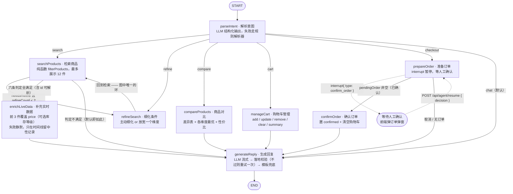
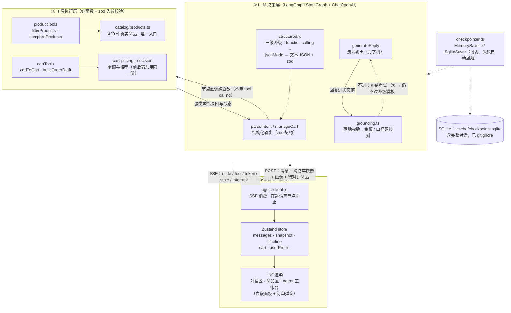
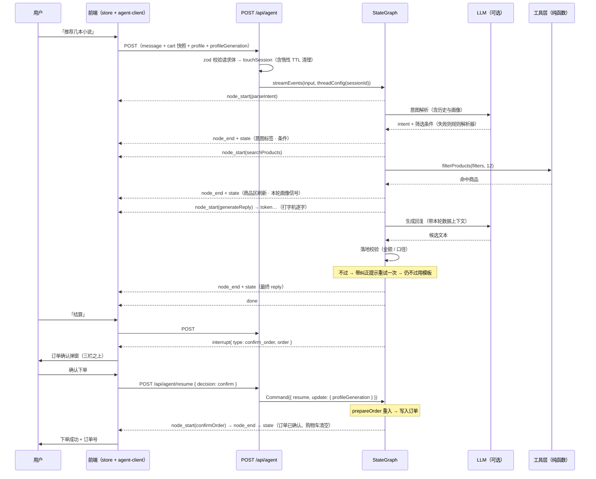

# 架构图与代码对照

> 本文档的三张图全部**先读代码再画**，每条节点名 / 条件边 / 状态字段 / 事件类型都能在下方的「代码对照表」里指到具体行。
> 图与代码不一致视为文档缺陷 —— 改代码时请一并更新本文件。

---

## 一、LangGraph 状态图

**环的收敛**：`refineSearch ⇄ searchProducts` 是图中唯一的环。退出条件是 `needsRefine && refineCount < MAX_REFINE_ROUNDS`（上限 **2**），否则「检索为空 → 放宽条件 → 仍为空」会一直绕环，直到撞上 LangGraph 的默认递归上限抛 `GraphRecursionError`。`refineSearch` 每进一次就 `refineCount + 1`，所以环最多转两圈。

**实时补充是插入点，不是新环**：`enrichLiveData` 挂在 `searchProducts → generateReply` 这条直线上（进不进由条件边的六条判定决定），出边无条件回到 `generateReply`。判定不通过时直接 `generateReply` —— **默认数据源下走的就是这条**，因此图行为与改造前完全一致。

**interrupt / resume 的语义**：`interrupt()` 实现为抛中断信号 → LangGraph 落一次 checkpoint 并暂停 → 用户确认后 `Command({ resume })` 恢复，`prepareOrder` 会**从头重新执行**，这一次 `interrupt()` 直接返回用户决策值。两个直接后果：

1. 订单号必须由 seed 确定性生成（`thread_id + messages.length + 购物车内容`）—— 否则弹窗里的单号与最终落单是两个号；
2. `interrupt()` 之前不能靠 `return` 写状态（返回值会被丢弃），所以订单与金额都在恢复之后才写入 `pendingOrder`。

---

## 二、三层架构

**三条边界值得说明**：

1. **LLM 只出现在 LLM 决策层**：工具层是纯函数，不接受 LLM 直接调用（不用 tool calling，见 `decisions.md` 第 2 条），因此「LLM 说了什么」与「系统做了什么」之间永远隔着节点代码。
2. **落地校验在 LLM 层的出口**：`generateReply` 的文本必须先过 `grounding.ts` 才能进状态 —— 它是「LLM 输出属于不可信输入」这条前提的唯一执行点。
3. **工具层被前后端共用**：`cart-pricing.ts` / `decision.ts` 既被服务端节点调用，也被右栏与购物车面板 import，所以「界面显示的金额」与「服务端算的金额」不可能分叉。

---

## 三、一次交互的时序

事件到界面的映射（`lib/agent/sse.ts` 的 switch，与 `lib/agent/events.ts` 的协议一一对应）：

| 事件 | 前端动作 |
| --- | --- |
| `run_start` | 重置本轮回复标记；`sessionId` 回执 |
| `node_start` / `node_end` | 右栏时间线新增「进行中」/ 标记完成（含耗时） |
| `tool_start` / `tool_end` | 右栏工具条目（当前节点直调纯函数，事件保留兼容） |
| `token` | 只来自 `generateReply`，进打字机缓冲 |
| `state` | 中栏商品区、右栏六段面板、购物车同步刷新；本轮 `profilePatch` 幂等合并 |
| `interrupt` | 订单确认弹窗 |
| `error` / `done` | 错误提示 / 本轮收尾 |

---

## 四、代码对照表（抽查用）

### 节点与边

| 图里写的 | 代码位置 |
| --- | --- |
| 9 个节点注册 | `lib/agent/graph.ts:65-73` |
| `START → parseIntent` | `lib/agent/graph.ts:74` |
| 6 条意图分支 | `lib/agent/graph.ts:75-83`（分流函数 `graph.ts:20-37`） |
| `refineSearch → searchProducts`（环） | `lib/agent/graph.ts:82` |
| `searchProducts` 的环退出条件 + 实时补充分支 | `lib/agent/graph.ts:83-87`（判定 `graph.ts:46-51`，上限 `lib/agent/state.ts:188`） |
| 六条判定（token / 结果 / 关键词 / id 可解析 / 冷却 / 熔断） | `lib/agent/nodes/enrichLiveData.ts:118-141`（纯函数 `shouldEnrich`） |
| 节点实现（最多 3 件、失败静默、时间线中性记录） | `lib/agent/nodes/enrichLiveData.ts:246-280` |
| 覆盖规则（只盖 price / 库存等级 + 划线价一致性） | `lib/justoneapi/overrides.ts`（`withLivePrice` / `withLiveStock` / `applyLiveOverride`） |
| 熔断标记（`globalThis` + 按自然日） | `lib/agent/nodes/enrichLiveData.ts:65-92` |
| `compareProducts / manageCart → generateReply` | `lib/agent/graph.ts:91-92` |
| `prepareOrder` 的条件边 | `lib/agent/graph.ts:93-96`（判定 `graph.ts:54-56`） |
| `confirmOrder → generateReply`、`generateReply → END` | `lib/agent/graph.ts:97-98` |
| 编译时注入 checkpointer | `lib/agent/graph.ts:106` |
| checkpointer 单例（globalThis + Promise） | `lib/agent/checkpointer.ts:81-86` |
| `thread_id` 隔离 | `lib/agent/checkpointer.ts:102-104` |
| `interrupt()` 调用点 | `lib/agent/nodes/prepareOrder.ts:57-60` |
| 订单号 seed（重入保持一致） | `lib/agent/nodes/prepareOrder.ts:31-40` |

### 状态字段（`lib/agent/state.ts`）

| 字段 | 行 | 合并语义 |
| --- | --- | --- |
| `messages` | 41 | 追加（`messagesStateReducer`，按 id 去重） |
| `intent` | 47 | 覆盖 |
| `searchFilters` | 53 | 浅合并（refine 只更新变化字段） |
| `searchResults` | 59 | 覆盖 |
| `liveOverrides` | 72 | **合并**（`mergeLiveOverrides`：多轮各自累积，不互相清空） |
| `liveFetchedAt` | 81 | 覆盖（60 秒冷却依据） |
| `compareTargets` | 87 | 覆盖 |
| `comparison` | 93 | 覆盖 |
| `cart` | 99 | 覆盖 |
| `toolCallLog` | 105 | 追加（右栏时间线） |
| `pendingOrder` | 111 | 覆盖（interrupt 载荷） |
| `focusProductId` | 125 | 覆盖（序数指代，消费后置 null） |
| `profilePatch` | 141 | 覆盖（每轮由 `parseIntent` 重置为 `[]`） |
| `profileGeneration` | 152 | 覆盖（客户端 generation 的原样回显） |
| `profileHint` | 164 | 覆盖（本轮是否带出偏好提示） |
| `needsRefine` | 170 | 覆盖（环的入口条件） |
| `refineCount` | 181 | 覆盖（环的收敛保证，上限见 188 行） |

### 事件与接口

| 图里写的 | 代码位置 |
| --- | --- |
| 事件协议 10 种 | `lib/agent/events.ts:66-76` |
| 快照字段（含 `liveOverrides` / `liveFetchedAt` / `profilePatch`） | `lib/agent/events.ts:44-66` |
| 请求体 / 恢复体契约 | `lib/agent/events.ts:78-103` |
| SSE 事件映射 | `lib/agent/sse.ts:157-231`（`toSnapshot` 在 `sse.ts:68-99`） |
| 只转发 `generateReply` 的 token | `lib/agent/sse.ts:31`、`sse.ts:210-223` |
| 图结束后无条件补推终态 + 检测中断 | `lib/agent/sse.ts:238-252` |
| 主入口（zod 校验 / 会话元信息 / config 透传画像） | `app/api/agent/route.ts:29-95` |
| 恢复入口（`Command({ resume, update })`） | `app/api/agent/resume/route.ts:43-53` |
| `runtime = 'nodejs'`（SqliteSaver 依赖原生模块） | `app/api/agent/route.ts:12-13`、`app/api/agent/resume/route.ts:8-9` |
| 前端分发（事件 → 界面） | `store/use-agent-store.ts` 的 `handleEvent` / `applySnapshot` |
| 在途请求单点中止 | `lib/agent-client.ts` 的 `abortActiveRequest()` |