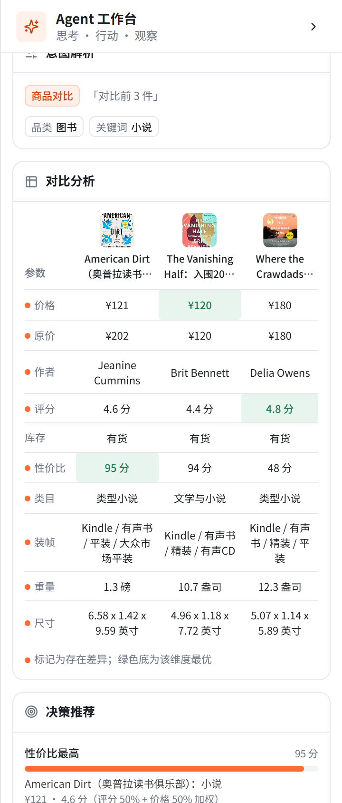

# 演示彩排记录

> 彩排日期：**2026-09-25** ｜ 代码状态：commit `fb70cf7`（彩排期间工作区干净，**未改任何业务代码**）
> 本轮只做两件事：补验最后一项没有浏览器证据的验收（前端「实时」标注）、把 [演示脚本](./demo-script.md) 三阶段完整走一遍并如实记录。
> 脚本中与实际不符的地方已在 [demo-script.md](./demo-script.md) 内改准（逐条对应本文第六节）；§7 验证状态、§8 已知问题的同步见 [project-status.md](./project-status.md)。
> **同日补充轮（2026-09-25，代码 commit `561e772`）**：关掉第六节的两处展示层瑕疵（C1 / C3，各带单测）、补上实时**失败路径**的浏览器取证（见第三节末尾）、把宽屏几何改成**真实 1440 视口实测**并入库证据图（本文图片 + `docs/rehearsal/`）。配额消耗 **0 次计费**（只有失败请求）。

| 目标 | 结论 |
| --- | --- |
| 补验前端「实时」标注 | ✅ **拿到浏览器截图 + DOM 断言**：卡片标注、hover 说明、时间线条目、回复价格一致四项全中 |
| 演示脚本三阶段彩排 | ✅ 9 个步骤全部走通（阶段 A 第 1–7 步 / 阶段 C 第 8 步 / 阶段 B 第 9 步）；发现 **12 处脚本描述与实际不符**（已改脚本）、**3 处展示层小瑕疵**（2 处已修 + 1 处记录不修，见第六节） |
| 演示翻车预案 | ✅ 三条；两条为实测，一条按数据来源推断（已逐条标注） |
| 同日补充轮 | ✅ 实时失败路径取证（0 计费）、两处展示层瑕疵已修（带单测，`561e772`）、宽屏在真实 1440 视口下实测并入库 4 张证据图 |

**JustOneAPI 配额消耗：补充轮 0 次计费**（3 次失败请求 `http=401 code=100`，未重试）；首轮彩排 3 次成功调用计费（价格端点 3 次，服务端日志三行均为 `http=200 code=0 attempt=1`，预算 ≤6 次未超）。

---

## 一、三阶段环境

| 阶段 | 数据源 | LLM | 启动方式 | 对应脚本步骤 |
| --- | --- | --- | --- | --- |
| **A · 主路径** | `real`（默认；彩排时为 112 件冻结快照，商品 id 为 ASIN） | 已配置 | `npm run dev` | 第 1–7 步 |
| **B · 实时补充** | `justoneapi`（28 件，`jd-` 前缀商品 id） | 已配置 | `$env:CATALOG_SOURCE='justoneapi'; npm run dev` | 第 9 步 |
| **C · 无 Key 降级** | `real`（默认） | **未配置** | 清空 `.env.local` 的 `LLM_API_KEY` → `npm run dev` | 第 8 步 |

- 改环境变量必须**重启 dev**（env 在进程启动时读取）。
- 阶段 C 的 `.env.local` 改动：彩排前备份到 `.cache/env.local.bak`（`.cache/` 已被 gitignore），彩排后原样还原，`SHA256` 与改动前一致（`313ADEA0…284F`）。全程只打印过键名，没有任何密钥值进入终端输出、文档或提交。
- 浏览器：首轮三次彩排用**内置浏览器**（视口被固定为窄屏 444×559，「对话 / 商品」Tab + 「Agent 工作台」抽屉）；阶段 A 与阶段 B 清空 localStorage 后开始，阶段 C 刻意保留画像（要用它验证模板回复里的偏好提示）。
- 补充轮的宽屏取证改用 **`agent-browser` CLI 驱动的本地 Chrome**（`set viewport 1440 900 2`）：真实宽视口、可整页/按选择器截图，因此宽屏数值与图片都是**实测**而非 iframe 推算（详见第八节）。窄屏截图（实时标注、失败路径）仍来自内置浏览器。

---

## 二、阶段 A · 默认源主路径（脚本第 1–7 步）

干净 localStorage 起步；「实际结果」为页面文本原文。**下表是 2026-09-25 目录为 112 件时的实测**（截图见 `.cache/rehearsal/`，该目录不进仓库）；同日目录扩容到 420 件后，第 1/3/6 步已重测，见本节末尾的「扩容后重测」。

| 步骤 | 操作 | 实际结果 | 通过 |
| --- | --- | --- | --- |
| 1 | 「推荐几本小说」 | 商品区「搜索结果 · 8 件商品 · 图书 · 小说」，渲染 8 张卡；时间线 3 条：`识别意图：搜索商品｜1192ms｜LLM 解析（JSON 模式） · 图书 · 小说`、`检索「图书 · 小说」｜1ms｜命中 8 件，展示前 8 件`、`生成回复｜959ms｜LLM 生成`；回复「找到 8 件小说，前 5 件如下：…」 | ✅ |
| 2 | 「刚才那个再便宜点」 | 条件收敛为「图书 · 小说 · ¥200 以内」；时间线 5 条，含 `第 1/2 轮调整条件｜图书 · 小说 → 图书 · 小说 · ¥200 以内`、`记起你的偏好：图书｜（来源：浏览）`；**回复顺序未变**（¥121/¥120/¥180/¥75/¥80，仍在结尾指出最便宜是第 4 件） | ✅（含 1 处脚本偏差，见第六节 S3） |
| 3 | 「对比前 3 件」 | 「对比分析」面板渲染 11 行 × 4 列（参数名 + 3 件商品），10 项参数：价格/原价/作者/评分/库存/性价比/类目/装帧/重量/尺寸；差异圆点 9 项、绿底最优 3 处（价格 ¥120、评分 4.8、性价比 95）；时间线 `对比 3 件商品｜共 10 项参数，其中 9 项存在差异 · 性价比最高：American Dirt…（¥121）`；「决策推荐」3 张卡给出量化理由 | ✅（含 2 处脚本偏差，S4/S5） |
| 4 | 「把第一件加入购物车」 | 购物车面板：American Dirt ¥121 × 1，明细 `商品合计（1 件）¥121 / 商品直降 −¥81 / 运费 包邮 / 应付 ¥121`；顶栏角标 = 1；时间线 `加入购物车｜653ms｜LLM 解析 · 已将 …× 1 加入购物车` | ✅（金额项名与脚本不同，S6） |
| 5 | 「结算」→ 点「确认下单 · ¥121」 | 弹窗「确认订单」（商品行、地址、支付宝、`商品原价合计 ¥202 / 商品现价合计 ¥121 / 运费 包邮 / 应付 ¥121`）；确认后弹窗收起（约 2.2s）、购物车清空、角标消失；时间线 `订单已确认：ES20260925075794｜1 种商品，实付 ¥121`、`下单成功：ES20260925075794｜1 种商品，实付 ¥121，已清空购物车`；同轮 `生成回复｜2617ms` 带**落地校验重试**文案（拦下 ¥200，见 S9） | ✅（含 2 处脚本偏差，S7/S8） |
| 6 | 「开启新会话」→「推荐点什么」 | 新会话（无历史、未说品类）仍落到「图书」：商品区「12 件商品 · 图书」；时间线 `识别意图：搜索商品｜923ms｜LLM 解析（JSON 模式） · 图书`、`记起你的偏好：图书｜本轮输入未给出品类/关键词，参考了历史偏好（来源：成交）`、`检索「图书」｜1ms｜命中 16 件，展示前 12 件`；偏好面板：常看品类 图书（成交）/ 关注品牌 Jeanine Cummins（成交）/ 最近搜索 小说 / 价位带 ¥121 - ¥200 | ✅（命中/展示口径需补准，S10） |
| 7 | 「前两件加起来多少钱」 | 回复拒绝自行求和、只原样引用单价；时间线 `生成回复｜2115ms｜LLM 生成 · 落地校验未通过（疑似编造金额 ¥255），已按纠正提示重试一次并采用重试结果` | ✅ |
| 1 备注 | 干净状态首轮**没有**「记起你的偏好」条目 | 正确行为：画像为空时不产出记忆事件；本轮搜索本身会写入「浏览」信号，第 2 步起才开始出现该条目 | ✅（脚本注释已改，S1） |

### 扩容后重测（2026-09-25，目录 112 → 420 件；SSE 直连 `/api/agent`，0 计费）

| 步骤 | 扩容后的实际结果 | 与扩容前对比 |
| --- | --- | --- |
| 1 · 「推荐几本小说」 | `检索「图书 · 小说」｜命中 30 件，展示前 12 件`；中栏「12 件商品 · 图书 · 小说」；回复「共检索到 12 件小说，前 5 件如下：1. Beneath a Scarlet Sky（Mark Sullivan）¥94，原价¥201，4.7分，评价5.6万 …」 | 命中 8 → **30 件**；展示 8 → **12 件**（展示上限） |
| 3 · 「对比前 3 件」 | `对比 3 件商品｜共 10 项参数，其中 9 项存在差异 · 性价比最高：Beneath a Scarlet Sky：小说（¥94）`；被对比的 3 件 = **Beneath a Scarlet Sky / American Dirt / Troubled Blood** | ⚠️ **前 3 件变了**（原为 American Dirt / The Vanishing Half / Where the Crawdads Sing）——见第九节 |
| 6 · 新会话 + 「推荐点什么」 | `命中 60 件，展示前 12 件`；中栏仍是「12 件商品 · 图书」；`记起你的偏好：图书｜（来源：成交）` 照旧出现 | 命中 16 → **60 件**；展示上限 12 不变 |

> 扩容后的完整表格（表头反映的是 112 件那轮的实测），第 2 步「件数与书单随当轮结果而定」已在脚本里改成不承诺具体数字。



---

## 三、阶段 B · 实时补充（脚本第 9 步，= 本轮补验的验收项）

以 `CATALOG_SOURCE=justoneapi` 启动，清空 localStorage 后两轮对话。

| 项 | 实际结果 |
| --- | --- |
| 第 ① 轮「推荐几款耳机」 | 商品区「4 件商品 · 数码 · 耳机」；`实时 ·` 在整页 DOM 出现 **0 次**；时间线只有 `识别意图 / 检索「数码 · 耳机」 / 生成回复` → **条件边第 3 条挡住，零调用** ✅ |
| 第 ② 轮「按现在的价格推荐几款耳机」 | 3 张卡片价格旁出现 `实时 · 09:42`（DOM 断言：3 个叶子节点、文本全为「实时 · 09:42」、均在商品卡 `<article>` 内）；第 4 件（Viken ¥198）**无**标注 → 单轮 3 件上限生效 ✅ |
| hover 说明 | 悬停后 Tooltip 出现（`data-state=delayed-open`），原文：`该价格为 09:42 的京东实时查询结果；评分、销量、描述等字段仍来自快照数据` ✅ |
| 右栏时间线 | `补充实时数据 · 3 件价格`｜`16014ms`，位置在「检索「数码 · 耳机」」与「生成回复」之间 ✅ |
| grounding 衔接（硬要求） | 回复引用的 4 个价格（¥376.4 / ¥99 / ¥237.8 / ¥198）与卡片逐个一致，该轮**没有**出现「落地校验未通过」条目 → 覆盖后的价格被算作真实数据 ✅ |
| 服务端调用 | `.cache` 日志 3 行 `endpoint=/api/jd/get-item-price/v1 http=200 code=0 attempt=1`（2670 / 3437 / 9905 ms）→ **3 次计费**，无重试、无库存端点调用（本轮问法不含库存关键词）✅ |
| 截图 | `.cache/rehearsal/live-badge.png`（卡片标注）、`live-badge-hover.png`（tooltip）、`live-timeline.png`（时间线条目） |


### 失败路径（补充轮补验，0 计费）

配置：`$env:CATALOG_SOURCE='justoneapi'; $env:JUSTONEAPI_TOKEN='invalid-rehearsal-token'; npm run dev`（**无效但非空** → 源检查通过、条件边照常触发，调用必然 401）。清空 localStorage 后同样两轮对话。

| 项 | 实际结果 |
| --- | --- |
| 无实时标注 | 全页 DOM 搜 `实时 ·` **0 处**（元素级与 innerHTML 均为 0）；4 张卡片价格旁都没有标注 ✅ |
| 右栏时间线 | 本轮 5 条：`识别意图：细化条件｜898ms｜LLM 解析（JSON 模式） · 历史 302 字 · 数码 · 耳机`、`第 1/2 轮调整条件｜1ms｜数码 · 耳机 → 数码 · 耳机`、`检索「数码 · 耳机」｜1ms｜命中 4 件`、**`实时数据不可用，已用快照数据｜1409ms｜部分商品未取到实时值，已保留快照数据`**、`生成回复｜1098ms｜LLM 生成`（中性图标，非红色）✅ |
| 无报错 | 全页文本断言：`失败` 0、`错误` 0、`error` 0、`重试` 0；`[role=dialog/alertdialog/alert]` 数量 0；无弹窗、无红色横幅、无需点「确定」的交互 ✅ |
| 对话正常 | 商品区仍 4 件、回复完整生成（逐字见下），对话未中断 ✅ |
| 服务端调用 | 3 行 `endpoint=/api/jd/get-item-price/v1 http=401 code=100 attempt=1`（758 / 503 / 145ms）→ **未计费**（失败不计费）✅ |
| 截图 | `rehearsal/live-fallback.png`（时间线含中性条目）、`.cache/rehearsal/live-fallback-cards.png`（卡片无标注） |


> 失败轮的回复会照抄用户措辞（本例开头写「按当前价格，检索到 4 款耳机」），但价格**来自快照**——判定依据是标注缺失与时间线那条中性记录，不是回复文案。

> 仍未重复验证的只有**库存模式**（「3 件价格 + 3 件库存」）——它需要真实计费调用，按配额预算刻意不重复（上一轮已有服务端实测 + 单测，见第九节未覆盖项）。失败路径已在上面补验。

---

## 四、阶段 C · 无 Key 降级（脚本第 8 步）

清空 `LLM_API_KEY` 后重启（`llmEnabled` 快照为 `false`），在**保留上一轮画像**的会话里连走四步。

| 步骤 | 操作 | 实际结果 | 通过 |
| --- | --- | --- | --- |
| 1 | 「推荐几本小说」 | 商品区 8 件；标题旁出现 **`规则兜底` 徽标**；时间线 4 条：`识别意图：搜索商品｜1ms｜规则解析 · 小说`、`记起你的偏好：图书｜1ms｜（来源：成交）`、`检索「图书 · 小说」｜1ms｜命中 8 件`、`生成回复｜1ms｜模板兜底`；回复是模板文案「为你找到 8 件符合条件的商品（图书 · 小说）：…」，**末尾带出**「注意到你之前买过图书，需要我按这个方向再找找吗？」 | ✅ |
| 2 | 「对比前 3 件」 | 对比表正常（11 行 × 4 列，差异 8/10，绿底最优 3 处）；时间线 `对比 3 件商品｜共 10 项参数，其中 8 项存在差异 · 性价比最高：The Boy, the Mole, the Fox and the Horse（¥75）`；意图为「规则解析」 | ✅ |
| 3 | 「把第一件加入购物车」 | 购物车面板：Where the Crawdads Sing ¥180 × 1，明细 `商品合计（1 件）¥180 / 运费 包邮 / 应付 ¥180`（该件无折扣，故**没有**「商品直降」行）；角标 = 1；时间线 `加入购物车｜1ms｜规则解析 · 已将 … × 1 加入购物车` | ✅ |
| 4 | 「结算」→ 确认下单 | 弹窗正常（约 1.76s 出现），按钮「确认下单 · ¥180」；确认后弹窗收起、购物车清空、角标消失；时间线 `订单已确认：ES20260925995029｜1ms｜1 种商品，实付 ¥180`、`下单成功：ES20260925995029｜1ms｜1 种商品，实付 ¥180，已清空购物车`、`生成回复｜1ms｜模板兜底` | ✅ |

> 全 4 轮时间线**没有**出现任何「LLM 解析 / LLM 生成」字样，符合降级预期。截图：`c1-badge.png`、`c1-timeline.png`、`c2-compare.png`、`c4-dialog.png`、`c4-confirmed.png`。

---

## 五、实测耗时（用于校准脚本里的时长标注）

系统侧耗时取时间线各条目自报的 `ms`（求和与实际墙面耗时吻合）：

| 脚本步骤 | 系统侧实测 | 脚本原标注 | 结论 |
| --- | --- | --- | --- |
| 第 1 步 | 2.2s（1192 + 1 + 959ms） | 约 40s | 标注是**讲解节奏**（含口播），不是系统耗时 |
| 第 2 步 | 3.3s | 约 30s | 同上 |
| 第 3 步 | 2.0s | 约 40s | 同上 |
| 第 4 步 | 3.6s | 约 20s | 同上 |
| 第 5 步 | 2.5s 出弹窗 → 确认后 2.2s 收起 → 回复 2.6s | 约 40s | 同上 |
| 第 6 步 | 2.8s | 约 40s | 同上 |
| 第 7 步 | 3.2s | 约 40s | 同上 |
| 第 8 步（无 Key） | 每步 **1–3s**（时间线全部 `1ms` 级，含「购物车操作」2ms） | 约 30s（需重启） | 主导成本是**重启 dev**（约 20–30s），不是对话 |
| 第 9 步（实时补充） | 第 ② 轮 **约 17.5s**（节点单步 `16014ms` + 回复 1.4s；三次价格调用 2.7 / 3.4 / 9.9s） | 约 40s | **这一步明显更慢，演示时要提示观众**「正在查京东实时接口」 |

**合计**：主路径 7 步的系统侧耗时约 **20 秒**（讲解时间另计）——脚本「五分钟完整版 / 两分钟精简版」是**讲解节奏**的两个档位，不是系统耗时；标注已按此改写。

---

## 六、彩排中发现的问题

### 6.1 脚本问题（已在 `demo-script.md` 改准）

| # | 位置 | 脚本原写 | 实际 | 处理 |
| --- | --- | --- | --- | --- |
| S1 | 第 1 步 | 时间线 3 条 = 识别意图 / **记起你的偏好** / 检索 | 干净状态是 识别意图 / 检索 / **生成回复**；「记起你的偏好」只在**已有画像且本轮输入未给出品类/关键词**时插入 | 改准（并说明干净状态首轮不会出现） |
| S2 | 第 1、2、6 步 | 「预期画面」逐字引用 LLM 文案 | 同一问法两次实测分别是「找到 8 件小说」「共检索到 8 件小说」；LLM 文案会波动 | 脚本头部改为「**状态类文案**（时间线/面板/标题）为实测原文；**LLM 生成文案**仅示意」 |
| S3 | 第 2 步 | 「回复按价格从低到高重排」 | 「再便宜点」被解析为 refine + 预算 ≤200（条件**确实**收敛），但**排序没变**；排序需要明确指令——实测「**按价格从低到高排**」可用（价格升序 75→80→96→101→101→120→121→180） | 删掉「重排」承诺，改为可走通的说法 |
| S4 | 第 3 步 | 「中栏商品卡出现多选标记」 | 卡片标记只由**用户**点「加入对比」写入（`store/use-ui-store.ts` 的 `compareIds`），Agent 对比不会点亮卡片 | 删掉该句 |
| S5 | 第 3 步 | 对比表 8 行固定清单 | 实际 10 行：固定行（价格/原价/评分/库存/性价比/类目）+ 随所选商品而变的参数差异行（本次 作者/装帧/重量/尺寸；图书无「品牌」） | 改写为「固定行 + 动态差异行」 |
| S6 | 第 4 步 | 金额明细「商品合计 / **优惠券** / 运费 / 应付」 | 实际是「商品合计 / **商品直降** / 运费 / 应付」；「优惠券」只在满 300 减 30 生效时出现（本次 1 件 ¥121 不满门槛） | 改为条件说明 |
| S7 | 第 5 步 | 「2 种商品、实付 ¥451」 | 本次购物车 1 件，实付 ¥121；金额只取决于购物车内容 | 标注示例数字为「仅示意」 |
| S8 | 第 5 步 | 「订单状态变为 `confirmed`」 | 界面上没有该字段可看（状态在服务端），可见证据是弹窗收起 + 购物车清空 + 时间线两条 | 改写为可见证据 |
| S9 | 第 5 步 | 落地校验重试只写在第 7 步 | 实测**第 5 步也触发了一次**（拦下 ¥200）；落地校验在任意一步都可能触发 | 脚本加说明「这是常态，不是异常」 |
| S10 | 第 6 步 | 检索条目只写「12 件商品」 | 时间线原文是「命中 16 件，展示前 12 件」（命中 = 品类全量，展示 = 上限） | 补准 |
| S11 | 第 8 步 | 未说明无 Key 时意图面板的字段差异 | 规则路径把题材词显示为「功能」（LLM 路径显示「关键词」）；同一 thread 混合两种解析来源时，条件串可能重复一个词（如「图书 · 小说 · 小说」） | 加备注，避免现场被问住 |
| S12 | 脚本头部 | 「全部步骤已在当前代码上真机跑通（2026-09-24）」 | 该结论只覆盖当时那条链路；本轮补上了三阶段彩排与各步骤的真实出处 | 改为「2026-09-25 三阶段彩排」 |

### 6.2 代码侧瑕疵（补充轮的处理结果）

首轮彩排按「不为演示更好看改业务逻辑」只做记录；补充轮有意放宽到**只修展示层**（不动 filters、不动解析语义、不动节点编排），结果如下：

| # | 现象 | 定位 | 处理（补充轮） |
| --- | --- | --- | --- |
| C1 | 条件串出现重复词（实测「图书 · 小说 · 小说」） | `describeFilters`（`lib/agent/ruleParser.ts`）按 品类 → keywords → tags 依次拼接，**不做跨列表去重**；题材词在两份列表里同时出现时就会重复 | ✅ **已修（commit `561e772`）**：按「首次出现」保序跨列表去重，**只清洗展示结果**（filters 本身不变，已用同一次运行的快照证明 `keywords` 与 `tags` 仍各含「小说」）；单测 3 条锁定「同词只出现一次」「不同词内容与顺序不变」 |
| C2 | 意图解析面板字段名不统一：同一条链路上 LLM 路径显示「关键词 小说」、规则路径显示「功能 小说」 | 两种解析器对同一题材词的归类不同（keywords vs tags），面板按各自字段渲染 | ⛔️ **决策：不改（只记录）**。理由：① 现象的根因是**解析语义**（哪个词进哪个桶），改它超出「只动展示标签」的授权；② 只改标签（例如把 tags 也显示成「关键词」）会让两份列表同时非空时出现**两行同名标签**，正是任务里要求「停下」的情形；③ 改动落在 `components/visualization/intent-section.tsx`，但**并不能消除**现场观察到的不一致（每次只显示其中一支）。结论：保持现状，演示时按第 8 步的备注说明 |
| C3 | LLM 失败时时间线原样显示服务商错误文本，其中含服务商掩码后的密钥末位 | `parseIntent` 把 `llmError` 截 80 字写进 `sourceText`（`lib/agent/nodes/parseIntent.ts`） | ✅ **已修（commit `561e772`）**：新增 `sanitizeLlmError`，把 `Your api key: ****abcd is invalid` 一类片段整体换成「服务商鉴权失败」，保留 401 / request_id 等诊断信息；单测 3 条（含「普通失败文本不误伤」）。真机复现：无效 Key 下时间线为 `规则解析 · LLM 失败：401 Authentication Fails, 服务商鉴权失败(request_id: 6d70d081-…) · 小说`，**不含**密钥末位、不含 `api key` 字样 |

### 6.3 已解释、非缺陷（评审时可能被问到）

| 现象 | 解释 |
| --- | --- |
| 干净状态首轮没有「记起你的偏好」 | 画像为空 → 无记忆可带出；本轮搜索会写入「浏览」信号，第 2 步起才会出现该条目 |
| 输入里有「小说」却说「本轮输入未给出品类/关键词」 | 判据是**规则解析出的当前输入条件**（`lib/agent/nodes/parseIntent.ts` 的 `inputHasScope`）：题材词（小说）归 tags，既不算品类也不算关键词——脚本第 1 步的注释已写明这条判据 |
| 时间线「按轮重置」，看不到上一轮的条目 | 设计如此：前端每轮 `timeline: []`（`store/use-agent-store.ts`），服务端 `toolCallLog` 也是本轮裁剪。**演示时每一步都看当轮时间线**，不要去找历史条目 |
| 实时价与快照价完全相同（¥376.4 / ¥99 / ¥237.8） | 真实结果：快照构建时刻与现在相隔不久；脚本第 9 步的「诚实说明」已写 |

---

## 七、演示翻车预案（Plan B，可照念）

### B1 · LLM 服务商不可达 / 超时 / 401（**已实测**）

- **现场现象**：回复变慢或明显异常；右栏时间线出现 `识别意图：…｜规则解析 · LLM 失败：…`，回复条目变成 `模板兜底`。
- **怎么说（照念）**：「模型服务这会儿不可用，系统自动降级到了本地规则解析和模板回复——**这正是这个项目的设计目标：没有 API Key 也能完整跑通**。请看右栏，它把降级这件事也写在时间线上了。」
- **要不要重启**：要。env 只在进程启动时读取。
- **怎么切（实测有效，不改任何文件）**：

  ```powershell
  # 停掉当前 dev，然后：
  $env:LLM_API_KEY='invalid-demo'; npm run dev
  ```

  实测：非空无效值会覆盖 `.env.local`（服务商返回 401，被节点捕获 → 自动降级 → 全流程继续）。⚠️ 实测**空字符串不会生效**（会被 `.env.local` 的真实 Key 覆盖回来），所以要用一个非空无效值，或直接改 `.env.local` 后重启。
- **注意**：这种模式下 `llmEnabled` 仍为 `true`，商品区**不会**出现「规则兜底」徽标 —— 讲解时**指向时间线**，不要指徽标。想演「干净的无 Key 路径」（有徽标）就按脚本第 8 步：清空 `.env.local` 的 `LLM_API_KEY` 后重启。

### B2 · JustOneAPI 配额用尽（`code 303`）（**按已有实测的失败语义**）

- **现场现象**：第 9 步第二轮不再出现「实时」标注；时间线出现 `实时数据不可用，已用快照数据`；此后当日内不再进入该节点（进程内熔断，按自然日）。
- **怎么说（照念）**：「实时补充这一步今天配额已经用完了。它本来就是**条件触发的可选步骤**——失败会被静默降级，你们看到的就是快照价格，主链路完全不受影响。要证明它确实在图里，看两点：时间线上这条中性记录，和代码里那条条件边（六条判定）。」
- **操作**：**跳过第 9 步**，继续后面的内容；**不要现场重试**（重试会继续撞配额，且当日熔断后本来就不会再触发）。
- **依据**：上一轮实测无效 token 时正是这个表现（3 次 401 不重试、`liveOverrides` 为空、对话与回复一切正常、无错误弹窗），本轮单测覆盖了 `303` 触发熔断后条件边不再进入。

### B3 · 网络整体不可用（**按数据来源推断，未实测**）

- **可演示**：脚本第 1–7 步的**全部编排与数据**——商品目录是仓库里的本地 JSON 快照（`data/real-catalog.json`），规则解析器与模板回复是本地纯函数，interrupt 下单是本地图状态。
- **前提**：必须处于**无 Key 配置**（`llmEnabled=false`）。若 Key 仍在，每步都会先等一次 LLM 超时再降级（`timeout 20s`），演示节奏会被拖垮 —— 断网开场就先按脚本第 8 步改成无 Key 后重启。
- **必须跳过**：第 9 步（实时补充要访问京东接口）。
- **已知副作用（未实测）**：商品图是各平台原始 CDN 链接，断网时图片加载失败、卡片显示占位；文字、价格、评分、流程不受影响。

---

## 八、宽屏补验（补充轮，真实 1440 视口）

首轮彩排受内置浏览器限制（视口固定 444×559），宽屏只能靠同源 iframe **测量**。补充轮改用 `agent-browser` CLI 驱动本地 Chrome，把视口设成 **1440×900 / dpr 2**，以下数值与截图都是真实宽视口下的实测。


| 项 | 实测（真实 1440 视口） | 结论 |
| --- | --- | --- |
| 三栏宽度 | 左 `380`（x 0–380）/ 中 `700`（380–1080）/ 右 `360`（1080–1440），三栏 `position: static`，均在 `h-14` 顶栏之下（top 56、高 844） | ✅ 与文档口径一致 |
| 横向溢出 | `documentElement.scrollWidth = 1440`（= clientWidth） | ✅ 无横向滚动 |
| 对比表列宽 | 表格 `width 309`（x 1106–1415，右栏内），表头四列 `54 / 87 / 88 / 81`，10 行参数、**3 个绿底最优格**，父容器 `scrollWidth = clientWidth = 317`（**无横向滚动**），右边界 1415 < 1440（未溢出） | ✅ 见上图对比表截图 |
| 对比表 vs 时间线 | 两者在右栏上下排布，矩形**无交叠**（时间线 `top/bottom` 与表格 `280/732` 不相交） | ✅ 不重叠 |
| 「实时 ·」标注 | 默认 `real` 源下检索不到（预期：源不触发实时补充） | 宽屏**实时标注**截图仍缺（需真实计费调用，见第九节） |
| 「规则兜底」徽标 | 检索不到（预期：本实例 `llmEnabled=true`）。该徽标只在 `llmEnabled=false` 时渲染，而「清空 Key」只能用文件级改动实现 | 宽屏**徽标**截图仍缺（见第九节） |

**30 秒自查清单**（评审/演示前可自己核对，逐项都是「看哪个元素 → 期望值」）：

| # | 看哪里 | 期望值 |
| --- | --- | --- |
| 1 | 窗口宽度 ≥ 1280 时：左栏宽度 | 380px，且不是抽屉（无浮层、无遮罩） |
| 2 | 中栏宽度 | 自适应（1440 下为 700px）；1280 下为 540px |
| 3 | 右栏宽度与定位 | 360px、`position: static`（F12 里选中右栏 `aside`，Computed 面板可见） |
| 4 | 中栏「加入对比」勾 2–4 件 → 右栏「对比分析」 | 出现 3+ 列表格：首列是参数名，表头是商品名；每行参数名左侧有橙色差异圆点；各维度最优格为浅绿底，表下有「标记为存在差异；绿色底为该维度最优」 |
| 5 | 表格宽度 vs 右栏 | 表格完整落在右栏内、不出现横向滚动条、不与上方「推理时间线」卡片重叠 |
| 6 | 京东源 + 「按现在的价格推荐几款耳机」后 | 卡片价格旁出现「实时 · HH:mm」，鼠标悬停出说明；右栏时间线多一条「补充实时数据 · N 件价格」 |
| 7 | 清空 `.env.local` 的 `LLM_API_KEY` 并重启后 | 商品区标题旁出现橙色「规则兜底」徽标，鼠标悬停出「未配置 LLM，意图解析与回复走规则与模板」 |

---

## 九、未通过 / 未覆盖项（如实列）

| 项 | 状态 | 原因 |
| --- | --- | --- |
| ~~桌面三栏（≥1280px）视觉效果~~ | ✅ **已覆盖（补充轮）** | 真实 1440×900 视口（dpr 2）实测三栏 380 / 700 / 360 + 整页截图 + 对比表右栏截图，见第八节。**仍未覆盖**：宽屏下的「实时」标注截图与**暗色模式**截图（暗色仍只有上一轮的 iframe 测量式证据） |
| ~~实时标注的失败路径（`实时数据不可用，已用快照数据`）~~ | ✅ **已补验（补充轮，0 计费）** | 无效 token（非空）下浏览器取证：无标注、时间线一条中性记录、无报错、对话正常，见第三节末尾 |
| 宽屏下的「实时 ·」标注截图 | **未覆盖** | 需要一次**真实计费**的实时调用（本轮配额预算 0 次）；标注在窄屏下有截图（第八节第 6 条给了自查方法） |
| 宽屏下的「规则兜底」徽标截图 | **未覆盖** | 徽标只在 `llmEnabled=false` 时渲染，而「清空 Key」只能靠**文件级**改动 `.env.local` 实现（本轮硬约束：不改该文件；shell 注入空字符串会被文件值覆盖） |
| 实时标注的库存模式（`3 件价格 + 3 件库存`） | **未重复验证** | 需要真实计费调用（上一轮已有服务端实测 + 单测）；本轮问法也不含库存关键词，未触发详情端点 |
| `justoneapi` 源下的 加购 / 对比 / 下单 | **未覆盖** | 阶段 B 只走脚本第 9 步；§7.2 里这条限制仍然成立 |
| 断网场景（Plan B3） | **未实测** | 未做真实断网演练；B3 的操作与副作用按「数据来源 + 代码路径」推断，文中已标注 |
| 多轮重复彩排（模型输出波动） | **未覆盖** | 三阶段各走一次；LLM 文案与意图分类存在波动（第 2 步的排序差异即为一例），脚本已据此把「预期画面」分级为「稳定/示意」 |
| ~~彩排中发现的 3 处展示层瑕疵（C1–C3）~~ | ✅ **已处理（补充轮）** | C1 / C3 已修并带单测（commit `561e772`），C2 决策「不改」并写明理由，见 6.2 |
| 扩容后「前 3 件不变」的预期 | ❌ **不成立（与预期不符，已记录）** | 目录扩容后「对比前 3 件」的被对比对象从 American Dirt / The Vanishing Half / Where the Crawdads Sing 变成 **Beneath a Scarlet Sky / American Dirt / Troubled Blood**。**原因**：`--per` 只影响「每品类取多少」，对**构建**而言确实是「扩尾部、前 16 件逐字未变」（已用 1456/1456 字段比对证明），但**检索排序是相关性打分**（不是目录的评论数排序），匹配集从 8 件扩到 30 件后名次会重排。脚本第 3/4/5/7 步里引用具体商品名与金额的地方已改成「示例 / 随当轮结果变化」 |
| 本地化后 2 件商品描述过短 | ❌ **异常，未修（需你定）** | `amz-B0009IY8U6`（4 字「来自品牌」）、`amz-B00I35Z6JY`（6 字「来自制造商。」）：这两条**源数据的 description 是亚马逊 A+ 页 CSS**（5977 / 20747 字符），构建期只按长度 ≥ 60 把门，于是 CSS 混进目录；本地化后 LLM 只译出可见的那几个字。修法建议（与图书源同源）：命中 `aplus-v2` / `brand-story.cfg` / `display:block` 即丢弃该条——会改变「谁被接受」，因此**本轮未改**，已记入 project-status §8 第 22 条 |
| 「构建会丢上一轮本地化结果」 | ⚠️ **已知问题，已缓解** | 中文文案与 `nameOriginal` 都是 localize 脚本写进产物的，`catalog:build` 重新生成时不保留 → 「跳过已本地化条目」在 build → localize 完整流水线里第一次跑等于全量（420 条 / 70 批 / 221.5 秒）。已用「按 id + 英文原文一致才还原」把已验收的 112 件逐字还原（首次比对只有 16/112 未变，还原后 112/112）；根治方案见 project-status §8 第 23 条 |

---

## 十、解冻轮重走（2026-09-26）

> 上一轮彩排是 **112 件时代**；此后目录扩到 420、客户端瘦身、新增两个抽屉入口、中栏改成「共 N 件」、Bug A 修复、空结果态新增 —— 这些都没被端到端验证过，因此本轮重走。
> 范围：**A 阶段（默认源 + LLM）完整走一遍 + C 阶段（无 Key / 规则路径）完整走一遍**；**B 阶段（justoneapi）不重走** —— 本轮没动它的代码且需要计费，沿用 2026-09-25 的证据（见本文第三、九节）。
> 环境：`real` 源；浏览器为 `agent-browser` CLI 驱动本地 Chrome（**1440×900 / dpr 2**）；**JustOneAPI 配额 0 次计费**（B 阶段未执行）。

### 10.1 A 阶段逐步结果（默认源 + LLM）

| 步骤 | 操作 | 实际结果（时间线原文 / 中栏原文） | 系统侧耗时 | 与脚本 |
| --- | --- | --- | --- | --- |
| 1 | 「推荐几本小说」 | `识别意图：搜索商品｜939ms｜LLM 解析（JSON 模式） · 图书 · 小说`、`检索「图书 · 小说」｜1ms｜命中 30 件，展示前 12 件`、`生成回复｜1314ms｜LLM 生成`；中栏 `共 30 件 · 展示前 12 件 · 图书 · 小说`；回复列前 5 本（Beneath a Scarlet Sky ¥94 …） | 2.25s | ✅ 一致（含上一轮改的副标题口径） |
| 2 | 「刚才那个再便宜点」 | `第 1/2 轮调整条件｜图书 · 小说 → 图书 · 小说 · ¥200 以内`、`检索「…¥200 以内」｜1ms｜命中 30 件`、`记起你的偏好：图书（来源：浏览）`、`生成回复｜2205ms｜LLM 生成 · 落地校验未通过（疑似编造金额 ¥200），已按纠正提示重试一次并采用重试结果` | 4.55s | ✅ 件数不变（该批书全部 ≤¥200，脚本已写「随当轮结果而定」）；落地校验重试是脚本注明的常态 |
| 3 | 「对比前 3 件」 | `对比 3 件商品｜共 10 项参数，其中 9 项存在差异 · 性价比最高：Beneath a Scarlet Sky：小说（¥94）`；对比表 **11 行 × 4 列**、绿底最优 3 处、脚注「标记为存在差异；绿色底为该维度最优」；被对比 3 件 = Beneath a Scarlet Sky / American Dirt / Troubled Blood | 2.55s | ✅ 与脚本「扩容后实测」一致 |
| 4 | 「把第一件加入购物车」 | `识别意图：购物车操作 … 定位到第 1 件：Beneath a Scarlet Sky：小说`、`加入购物车｜524ms｜已将 … × 1 加入购物车`；购物车 1 件 | 3.22s | ✅ |
| 5 | 「结算」→「确认下单」 | 居中弹窗 `确认下单 · ¥106`；确认后 `订单已确认：ES20260926061407`、`下单成功：…实付 ¥106，已清空购物车`；成功弹窗约 4.2s 后自动关闭 | 弹窗 ~2s / 确认后 1.5s | ✅ **两个入口都验过**：抽屉「去结算」与聊天输入「结算」 |
| 6 | 开启新会话 → 「推荐点什么」 | `识别意图：搜索商品｜810ms｜LLM 解析（JSON 模式） · 图书`、`记起你的偏好：图书（来源：成交）`、`检索「图书」｜1ms｜命中 60 件，展示前 12 件`；中栏 `共 60 件 · 展示前 12 件 · 图书` | 3.10s | ✅ |
| 7 | 「前两件加起来多少钱」 | 意图标签实测为 `商品对比`；`生成回复｜2750ms｜LLM 生成 · 落地校验未通过（疑似编造金额 ¥1246），已按纠正提示重试一次并采用重试结果`；回复「数据里没有给出两件合计金额，我不做换算」 | 3.70s | ⚠️ 脚本原写 `闲聊兜底` → 已改准（见 10.4 R1） |

### 10.2 本轮改动的专项验证（全部通过）

| # | 验证项 | 结果 |
| --- | --- | --- |
| 1 | 顶栏购物车图标 → 抽屉「购物车」Tab；顶栏订单图标 → 抽屉「订单历史」Tab | ✅ 抽屉 `420×900`、贴右（x=1020）、`scrollWidth=1440` 无溢出；订单历史空态「还没有订单」，下单后显示 `ES20260926061407 / 已确认 · 待发货 / 1 种商品 / 实付 ¥106` |
| 2 | 抽屉里点「去结算」→ 先关抽屉、再出现居中弹窗 | ✅ 点击后 `[role=dialog]` 只剩居中那个（520×438、x=460、`tabs=[]`），**不叠层** |
| 3 | 确认下单后发任意消息 → 不再复发弹窗（Bug A） | ✅ 发「你好」后 `[role=dialog]` 数量 **0**（修复前该轮会收到 status=confirmed 的 interrupt 并重新弹窗）；`订单已确认/下单成功` 两条时间线仍在 |
| 4 | 刷新页面 → 不重播成功弹窗；订单历史仍在 | ✅ 刷新后 `successDialog=false`、无弹窗；`localStorage['eshop-orders']` 仍 1 条（`ES20260926061407 / confirmed / ¥106`） |
| 5 | 中栏副标题两种写法 | ✅ `共 30 件 · 展示前 12 件 · 图书 · 小说`（命中 > 展示）/ `1 件商品 · 数码 · ¥10000 以上`（命中 < 展示，不写「展示前」） |
| 6 | 空结果态（本轮新增） | ✅ 「十万元以上的商品」→ 中栏 `没有找到符合条件的商品` + `试试放宽条件（价格 / 品类），或看看下面的推荐` + 12 件精选（带「为你推荐」小标题，**不显示 0 件商品**）；闲聊「你好」→ 仍为 `为你推荐`（行为不变） |

### 10.3 C 阶段逐步结果（规则路径）

> **配置说明（与脚本第 8 步的差异）**：本轮硬约束是 `.env.local` 只读，因此改用 `$env:LLM_API_KEY='invalid-rehearsal-key'` 注入**无效但非空**的 Key（= 本文 Plan B1 的路径）。效果是意图解析与回复都走规则路径，但 `llmEnabled` 仍为 true、**不出现「规则兜底」徽标** —— 徽标那条证据沿用 2026-09-25 的记录（第四节），本轮改由**时间线**取证。

| 步骤 | 实际结果 | 系统侧耗时 |
| --- | --- | --- |
| C1 「推荐几本小说」 | `识别意图：搜索商品｜511ms｜规则解析 · LLM 失败：401 Authentication Fails, 服务商鉴权失败(request_id: …) · 小说`（**密钥片段已清洗、保留 401 与 request_id** —— §8-21 的修复在规则路径下的真机证据）、`记起你的偏好：图书（来源：成交）`、`检索「小说」｜1ms｜命中 30 件，展示前 12 件`、`生成回复｜73ms｜模板兜底`；模板回复末尾带出偏好提示 | 1.10s |
| C2 「对比前 3 件」 | `对比 3 件商品｜共 10 项参数，其中 8 项存在差异 · 性价比最高：The Boy, the Mole, the Fox and the Horse（¥75）`；对比表 11×4 | 0.65s |
| C3 「把第一件加入购物车」 | 先走抽屉清空上一轮的购物车（顺带验证规则路径下抽屉与「移除」按钮）→ 加购成功，`购物车 · 1` | — |
| C4 「结算」→ 确认下单 | 弹窗 `确认下单 · ¥180`；`订单已确认：ES20260926228507`、`下单成功：…实付 ¥180，已清空购物车`、`生成回复｜202ms｜模板兜底`；订单历史 2 条 | 0.20s |

**结论**：规则路径下 检索 / 对比 / 加购 / 结算 / 确认下单 全通，**两个抽屉（购物车 / 订单历史）在规则路径下均正常**；全轮时间线无一处「LLM 解析 / LLM 生成」字样。

### 10.4 与脚本不符处（已在 `demo-script.md` 改准）

| # | 位置 | 脚本原写 | 实测 | 处理 |
| --- | --- | --- | --- | --- |
| R1 | 第 7 步 | `识别意图：闲聊兜底｜1047ms` | 本轮是同问法、不同上下文，被分类为 `商品对比` | 改为「意图标签随问法波动（实测出现过 闲聊兜底 / 商品对比）」 |
| R2 | 第 8 步 | 「商品区标题旁出现 `规则兜底` 徽标」 | 无效 Key 注入（`.env.local` 只读）→ `llmEnabled` 仍 true、无徽标 | 补一句：无法改 `.env.local` 时用无效 Key 注入，取证看时间线；徽标路径见 2026-09-25 记录 |
| R3 | 第 8 步 | `检索「图书 · 小说」` | 规则路径下条件串是 `小说`（题材词进 keywords，未带品类） | 注明规则路径条件串可能只有题材词 |
| R4 | 第 4 / 5 步 | 只写聊天入口 | 抽屉也能加购/结算（先关抽屉再弹窗） | 上一轮已补进脚本，本轮复验 ✅ |
| R5 | 全篇 | 未覆盖空结果 | 新增三态后「搜索类意图 + 0 命中」有专门文案 | 脚本补一条可选演示动作（附「演示后点开启新会话清条件」提醒，原因见 10.5 F1） |

### 10.5 本轮发现（未修，交裁定）

- **F1 · 检索条件的「粘性」（真实缺陷，成本低但触及筛选语义）**：`searchFilters` 用的是**浅合并** reducer，而 `parseIntent` 的 `toFilters` 只写「本轮解析出来的字段」、不把未提到的字段置空 → 一旦某轮设过 `minPrice`（本轮实测：「十万元以上的商品」→ `minPrice=100000`），**后续新的搜索**若没重新给出该字段就会继承它（实测后续「推荐几本小说」仍带 ¥100000 下限 → 命中 0、中栏停在空结果态）。浅合并是 `refine`（「再便宜点」只改一个字段）的既定语义，因此修法要区分 search 与 refine 两条路径；**本轮不动**，已记 §8-32。
- **F2 · LLM 文案波动两例（非缺陷，判定以状态为准）**：① 空结果轮模型复述了上一轮对比（中栏文案才是判据）；② 有一轮把**已确认**的订单称作「待确认」（状态是 confirmed，看时间线与订单历史）。已记 §8-33。

---

## 十一、最终彩排（2026-09-26，目录 420 件，A + C 两阶段）

> 方法与范围：`agent-browser` 驱动 Chrome 1440×900（`set viewport 1440 900 2`），**全新浏览器 profile（干净 localStorage）**起步；A 阶段 = 默认源 + LLM；C 阶段 = **进程级把 `LLM_API_KEY` 覆盖为空**后重启（等价「清空 Key」，`.env.local` 只读、未改）。**B 阶段（justoneapi）未重走**（需计费），沿用第三、九节证据。**配额 0**（全程 real 源，无任何 JustOneAPI 外呼）。「实际结果」为页面文本原文与 localStorage / 快照读数。

### 11.1 A 阶段逐步结果（默认源 + LLM）

| 步 | 操作 | 实际结果 | 与脚本 |
| --- | --- | --- | --- |
| 1 | 「推荐几本小说」 | 中栏 `共 30 件 · 展示前 12 件 · 图书 · 小说`；时间线 3 条：`识别意图：搜索商品｜1492ms｜LLM 解析（JSON 模式） · 图书 · 小说`、`检索「图书 · 小说」｜1ms｜命中 30 件，展示前 12 件`、`生成回复｜1160ms｜LLM 生成`；回复 `共检索到 12 件小说…1. Beneath a Scarlet Sky（Mark Sullivan）¥94…`；干净画像下**无**「记起你的偏好」 | 一致 |
| 2 | 「刚才那个再便宜点」 | 中栏 `共 30 件 · 展示前 12 件 · 图书 · 小说 · ¥200 以内`；时间线 5 条（含 `记起你的偏好：图书｜（来源：浏览）`、`第 1/2 轮调整条件｜图书 · 小说 → 图书 · 小说 · ¥200 以内`） | 一致 |
| 3 | 「对比前 3 件」 | 对比表 3 列（Beneath a Scarlet Sky / American Dirt / Troubled Blood）；时间线 `对比 3 件商品｜共 10 项参数，其中 9 项存在差异 · 性价比最高：Beneath a Scarlet Sky：小说（¥94）`；决策推荐 97 / 94 / 100 分 | 一致 |
| 4 | 「把第一件加入购物车」 | 时间线 `识别意图：购物车操作 … 定位到第 1 件：…`、`加入购物车｜已将 Beneath a Scarlet Sky：小说 × 1 加入购物车`；购物车面板 `Beneath a Scarlet Sky ×1` | 一致 |
| 5 | 「结算」→「确认下单 · ¥106」 | 弹窗明细：`Beneath a Scarlet Sky：小说 ¥94×1`、地址 `泽飞 138****6688 / 广东省深圳市南山区科技园南区 8 栋 1203 室`、`支付宝`、`原价合计 ¥201 / 现价合计 ¥94 / 运费 ¥12 / 应付 ¥106`；确认后弹窗收起、购物车清空；时间线 `订单已确认：ES20260926922726｜1 种商品，实付 ¥106`、`下单成功：ES20260926922726｜…，已清空购物车` | 一致（当轮回复偏题复述了对比结果 —— 脚本 L66 注已说明） |
| 6 | 「开启新会话」→「推荐点什么」 | 中栏 `共 60 件 · 展示前 12 件 · 图书`；时间线 `识别意图：搜索商品｜LLM 解析 · 图书`、**`记起你的偏好：图书｜（来源：成交）`**、`检索「图书」｜命中 60 件`、`生成回复` | 一致 |
| 7 | 「前两件加起来多少钱」 | 回复拒绝求和、只原样引用单价（¥958 / ¥288）；时间线 `识别意图：闲聊兜底`（标签波动，脚本已注明）、`生成回复｜… 落地校验未通过（疑似编造金额 ¥1246），已按纠正提示重试一次并采用重试结果` | 一致 |

### 11.2 A 阶段专项验证（本轮改动集中处）

| 项 | 操作 | 结果 |
| --- | --- | --- |
| chip（脏会话） | 会话 `final-chip`：「100 元以内」（共 187 件）→ 点「服饰 60」 | 中栏 `共 60 件 · 展示前 12 件 · 服饰`；时间线 `识别意图…服饰 · ¥100 以内`、**`切换浏览目标：重置上一轮条件｜¥100 以内 → 服饰`**、`检索「服饰」｜命中 60 件`（截图 `final-chip.jpg`）✅ |
| chip tooltip | 合成 pointerover 后读 `[role=tooltip]` | `该品类目录共 60 件`（截图 `final-chip-tooltip.jpg`）✅ |
| 副标题三态 | 「500 元以内的透气跑鞋」/「十万元以上的商品」 | `2 件商品 · 运动 · 跑鞋 · 透气 · ¥500 以内`；空结果态 `没有找到符合条件的商品` + `试试放宽条件（价格 / 品类），或看看下面的推荐` + 下方 12 件精选、**全文无「0 件商品」** ✅ |
| 抽屉两入口 | 顶栏购物车 / 订单历史图标 | 抽屉（`dialogs=1`）标题 `我的购物车`、Tab `购物车｜订单历史`；订单卡片 `ES20260926922726 / 已确认 · 待发货 / 2026-09-26 13:07 / 1 种商品 / Beneath a Scarlet Sky：小说 × 1 / 实付 ¥106`；订单图标直达「订单历史」Tab（`aria-selected=true`）✅ |
| 抽屉「去结算」时序 | 加购一件 → 抽屉内点「去结算」 | `dialogs=1`（只有居中确认弹窗，抽屉已关、不叠层）；「取消」后 `dialogs=0`、未产生新订单 ✅ |
| 确认后不复发 | 确认下单 → 发「你好」 | `dialogs=0` ✅ |
| 刷新不重播 | 刷新页面 | `dialogs=0`、订单历史仍在、对话/中栏/意图面板恢复；**时间线回到空态**（`timeline` 不持久化，见 11.4）✅ |

### 11.3 C 阶段逐步结果（规则路径）

| 项 | 操作 | 实际结果 |
| --- | --- | --- |
| 徽标 | 首轮后读页面 | **「规则兜底」徽标出现**（`llmEnabled=false`）—— 关掉 §7.1 里「徽标未复验」的遗留 ✅ |
| chip（本轮修复点） | 新会话点「服饰 60」 | **`共 60 件 · 展示前 12 件 · 服饰`**（原为 chat、0 检索）；时间线 `识别意图：搜索商品｜规则解析 · 服饰`、`检索「服饰」｜命中 60 件`、`生成回复｜模板兜底`；全轮无「LLM 解析 / LLM 生成」✅ |
| 检索 | 「推荐几本小说」 | `共 30 件 · 展示前 12 件 · 小说`（条件串为 `小说`、不带品类 —— 脚本已注明）；模板回复 `为你找到 **12** 件符合条件的商品（小说）：…` ✅ |
| 对比 | 「对比前 3 件」 | 对比表 + `对比 3 件商品｜共 10 项参数，其中 8 项存在差异 · 性价比最高：The Boy, the Mole, the Fox and the Horse（¥75）` + `生成回复｜模板兜底` ✅ |
| 加购 | 「把第一件加入购物车」 | 购物车 `Where the Crawdads Sing × 1`、`商品合计 ¥180 / 运费 包邮 / 应付 ¥180` ✅ |
| 结算 → 确认下单 | 「结算」→「确认下单 · ¥180」 | `订单已确认：ES20260926470717｜1 种商品，实付 ¥180`、`下单成功：…，已清空购物车`；模板回复明确报出订单号与地址 ✅ |

### 11.4 「时间线前两轮未渲染」的实测结论

| 实验（冷启动 dev） | 结果 |
| --- | --- |
| 全新会话 · 首轮 | 时间线 3 条 ✅ |
| 同会话 · 第二轮（refine） | 5 条 ✅ |
| 第二会话 · 首轮 / 第二轮（chat） | 3 / 3 条 ✅ |
| **刷新页面** | 时间线回到空态（`等待 Agent 行动`），**而快照里仍有 5 条**；对话 / 中栏 / 意图面板全部恢复 ✅ 复现 |
| 刷新后 · 下一轮 | 时间线自动恢复（5 条）✅ |

**结论：「前 N 轮不渲染」不能复现**；能复现的是「**整页重载（刷新 / dev 的 Fast Refresh 强制 reload）后时间线为空**」——`timeline` **不持久化**（`partialize` 只存 `sessionId` / `messages` / `snapshot` / `userProfile`），其余面板都会恢复，所以看起来像「时间线没渲染」。原始那次观察的触发源就是旧 dev 日志里的 `⚠ Fast Refresh had to perform a full reload`（会话期间有文件写入），与刷新同签名。已记 §8-35；`demo-script.md` 准备一节加了「开场预热」。

### 11.5 与脚本不符处与新发现

| # | 位置 | 情况 | 处理 |
| --- | --- | --- | --- |
| R6 | 准备 | 脚本未提「时间线空态」的规避与恢复 | 准备一节补「开场预热 + 不要刷新 / 不要改文件 + 空态发一条即恢复」 |
| R7 | 第 8 步 | 无 Key 下的 chip 行为未写 | 补一句：品类 chip 在规则路径下同样可用（实测「服饰 60」→ 60 件） |

**新发现（记录、未修，已记 §8-36）**：

- **F3 · 规则路径「题材词进 tags」导致类别残留**：先点「服饰」chip（或任何带品类的轮次）后说「推荐几本小说」→ 规则解析把「小说」归入 `tags`，而「切换浏览目标」判据只认 `category` / `keywords` → 不切换品类，仍检索「服饰 · 小说」→ 0 命中被自动放宽丢掉「小说」→ 回到服饰全量。LLM 路径正常（30 件）。**修复前后行为一致（非本轮引入）**。
- **F4 · 规则路径把「第一」抽成关键词**：`把第一件加入购物车` → 条件串被写成「第一」并顶掉上一轮条件（加购本身正常，由序号定位；检索结果不受影响）。**修复前后行为一致（非本轮引入）**。